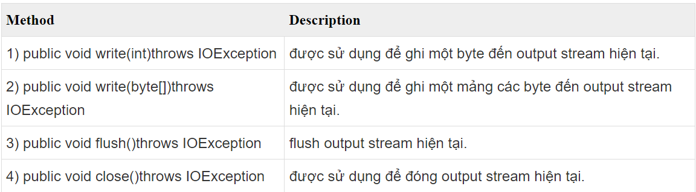
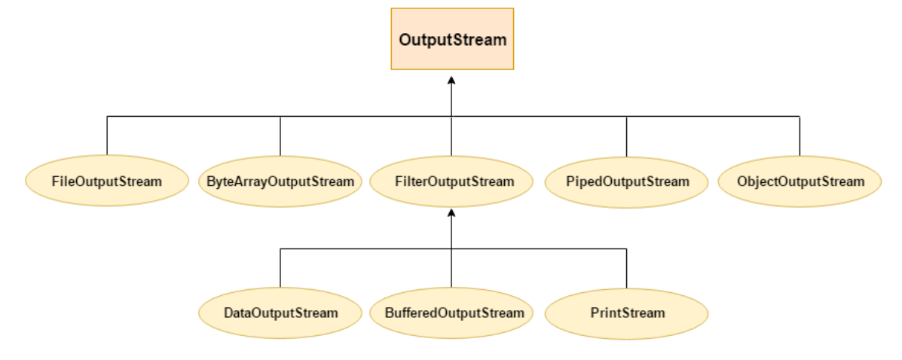
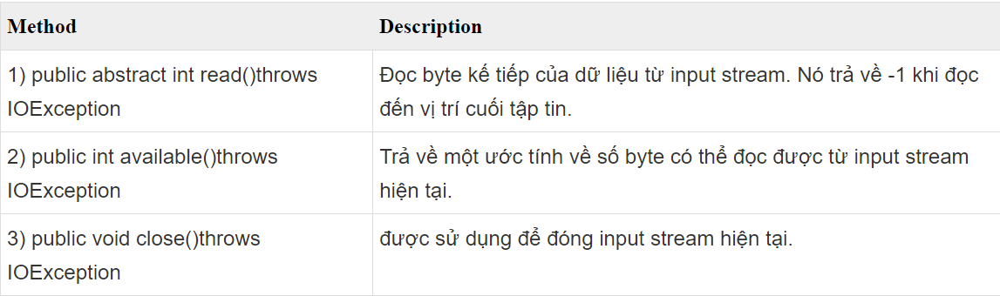
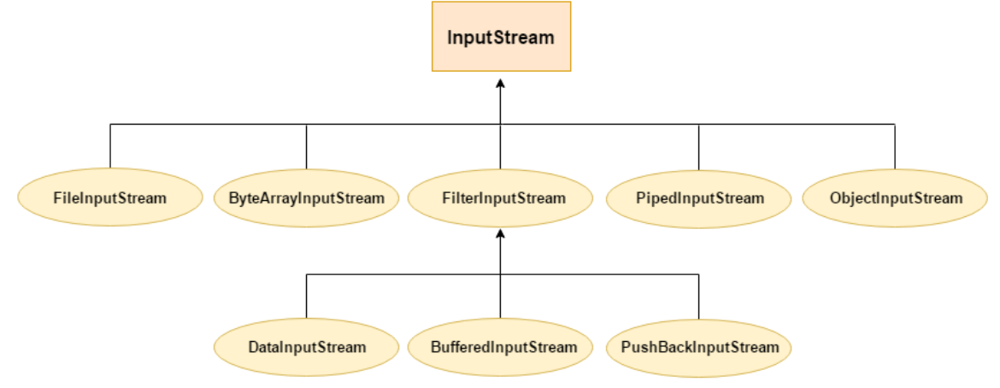
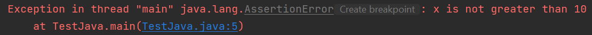

# [BUỔI 10] - NHẬP XUẤT FILE, UNIT TEST

## 1. Xử lý file trong Java
### Input/Output trong java
Java I/O hay Input/Output trong java được sử dụng để xử lý đầu vào và đầu ra trong java.

Java sử dụng khái niệm stream để làm cho hoạt động I/O nhanh hơn. Gói java.io chứa tất cả các lớp cần thiết cho hoạt động input và output.

### Khái niệm về stream
Một stream là một dãy dữ liệu. Trong java, một stream bao gồm các byte. Nó được gọi là stream (dòng chảy) vì nó giống như một dòng nước chảy liên tục.

Trong java, 3 stream được tạo cho chúng ta một cách tự động. Tất cả các stream này được gắn với console.

1) System.out: output stream tiêu chuẩn

2) System.in: input stream tiêu chuẩn

3) System.err: error stream tiêu chuẩn

### Các lớp OutputStream với InputStream
Giải thích về các lớp OutputStream và InputStream được trình bày như dưới đây:

#### **OutputStream:**

Ứng dụng Java sử dụng một output stream để ghi dữ liệu đến đích, nó có thể là một tệp tin, một mảng, thiết bị ngoại vi hoặc socket.

Lớp OutputStream là một lớp trừu tượng. Nó là super class của tất cả các lớp đại diện cho một output stream của các byte. Một output stream chấp nhận ouput các byte và gửi chúng đến một nơi có thể chứa.

**Các phương thức của lớp OutputStream**


**Hệ thống cấp bậc của OutputStream**


#### **InputStream:**
Ứng dụng Java sử dụng một input stream để đọc dữ liệu từ một nguồn, nó có thể là một tệp tin, một mảng, thiết bị ngoại vi hoặc socket.

Lớp InputStream là một lớp trừu tượng. Nó là super class của tất cả các lớp đại diện cho một input stream của các byte.

**Các phương thức của lớp InputStream**


**Hệ thống cấp bậc của InputStream**


### Đọc ghi file trong Java

Có 3 kiểu stream được sử dụng để đọc ghi file trong java đó là byte stream, character stream và buffered stream. Ngoài ra bạn còn có thể sử dụng Scanning (đọc) và Formatting (ghi).

#### 1.1. Đọc ghi file trong Java với byte stream

- **FileInputStream và FileOutputStream**

Lớp FileInputStream trong java đọc được các byte từ một input file.
  
Lớp FileOutputStream là một output stream được sử dụng để ghi dữ liệu vào một file theo định dạng byte (byte stream)

Ví dụ với file fileIn.txt có nội dung "12345678"
```java


import java.io.*;

public class TestJava{
    public static void main(String[] args) throws FileNotFoundException, IOException {
        FileInputStream fileIn = new FileInputStream("C:/Users/dell/Documents/Data1.txt");
        FileOutputStream fileOut = new FileOutputStream("C:/Users/dell/Documents/Data2.txt");
        int i = -1;
        // Đọc lần lượt các byte (8bit) trong luồng và lưu vào biến i
        // Khi đọc ra giá trị -1 nghĩa là kết thúc luồng.
        while((i = fileIn.read()) != -1)
        {
            System.out.println(i);
            fileOut.write(i);
        }
        fileIn.close();
        fileOut.close();
    }
}
```

Kết quả thu được là file output.txt được tạo và có nội dung giống file input.txt. Trên màn hình console, có kí tự được in từng dòng một là do các byte được đọc 1 cách lần lượt.

```
49
50
51
52
53
54
55
56
13
10
```

Cũng tương tự như ví dụ trên, nhưng lần này chúng ta sẽ đọc cùng lúc 10 byte
```java
import java.io.*;

public class TestJava{
    public static void main(String[] args) throws FileNotFoundException, IOException {
        FileInputStream fileIn = new FileInputStream("C:/Users/dell/Documents/Data1.txt");
        FileOutputStream fileOut = new FileOutputStream("C:/Users/dell/Documents/Data2.txt");
        int i = -1;
        byte[] bytes = new byte[10];
        while((i = fileIn.read(bytes)) != -1)
        {
            System.out.println(new String(bytes, 0, i));
            fileOut.write(bytes, 0, i);
        }
        fileIn.close();
        fileOut.close();
    }
}
```
Kết quả trên màn hình console:
```java
12345678
```
- **Sử dụng ByteArrayInputStream & ByteArrayOutputStream (Byte Stream)**

Ví dụ sử dụng ByteArrayInputStream:
```java
import java.io.*;

public class TestJava{
    public static void main(String[] args) throws FileNotFoundException, IOException {
        byte[] buf = new byte[] {'m', 'o', 't', 'n', 'g', 'u', 'o', 'i', 'd', 'u', 'n', 'g', 't', 'u', 'x', 'a'};
        ByteArrayInputStream byt = new ByteArrayInputStream(buf);
        int k = 0;
        while((k = byt.read()) != -1)
        {
            char ch = (char) k;
            System.out.println("ASCII value of Character is:" + k + " - Special character is: " + ch);
        }
    }
}
```
Kết quả hiện ra trên console:
```java
ASCII value of Character is:109 - Special character is: m
ASCII value of Character is:111 - Special character is: o
ASCII value of Character is:116 - Special character is: t
ASCII value of Character is:110 - Special character is: n
ASCII value of Character is:103 - Special character is: g
ASCII value of Character is:117 - Special character is: u
ASCII value of Character is:111 - Special character is: o
ASCII value of Character is:105 - Special character is: i
ASCII value of Character is:100 - Special character is: d
ASCII value of Character is:117 - Special character is: u
ASCII value of Character is:110 - Special character is: n
ASCII value of Character is:103 - Special character is: g
ASCII value of Character is:116 - Special character is: t
ASCII value of Character is:117 - Special character is: u
ASCII value of Character is:120 - Special character is: x
ASCII value of Character is:97 - Special character is: a
```

```java
import java.io.*;

public class TestJava{
    public static void main(String[] args) throws FileNotFoundException, IOException {
        FileOutputStream fos = new FileOutputStream("C:/Users/dell/Documents/Data1.txt");
        ByteArrayOutputStream bous = new ByteArrayOutputStream();
        bous.write("hehe".getBytes());
        bous.writeTo(fos);
        bous.flush();
        bous.close();
    }
}
```
Kết quả trên file Data1.txt:
```java
hehe
```

- **Sử dụng DataInputStream và DataOutputStream** 
Lớp DataInputStream trong java cho phép một ứng dụng đọc dữ liệu nguyên thủy từ luồng đầu vào một cách độc lập với máy.Lớp DataOutputStream trong java cho phép một ứng dụng ghi các kiểu dữ liệu Java nguyên thủy đến output stream một cách độc lập với máy.

Ví dụ 1: Sử dụng DataInputStream
```java
import java.io.*;
public class TestJava {
    public static void main(String[] args)throws IOException {
        InputStream input = new FileInputStream("C:/Users/dell/Documents/Data1.txt");
        DataInputStream inst = new DataInputStream(input);
        String content = inst.readLine();
        System.out.println("Content: " + content);
        inst.close();
    }
}
```
Kết quả trên console: 
```java
Content: hehe
```

```java
import java.io.*;
public class TestJava {
    public static void main(String args[])throws IOException {
        String name = "Doan Thao Van";
        OutputStream file = new FileOutputStream("C:/Users/dell/Documents/Data2.txt");
        DataOutputStream data = new DataOutputStream(file);
        data.writeUTF(name);
        data.flush();
        data.close();
    }
}
```
Kết quả trong file Data2.txt:
```java

Doan Thao Van
```

#### 1.2. Đọc ghi file trong Java với character stream

Lớp FileReader trong java được sử dụng để đọc các dữ liệu theo định dạng ký tự trong một file. Lớp FileWriter trong java được sử dụng để ghi các dữ liệu theo định dạng ký tự vào một file. Chúng ta nên sử dụng 2 lớp này khi thao tác với file ký tự.

Do là Character Stream nên khi sử dụng 2 lớp này, chúng ta không cần chuyển đổi về mảng byte để đọc/ghi.

Ví dụ:
```java
import java.io.*;
public class TestJava {
    public static void main(String args[])throws IOException {
        FileReader in = new FileReader("C:/Users/dell/Documents/Data1.txt");
        FileWriter out = new FileWriter("C:/Users/dell/Documents/Data2.txt");
        int k = 0;
        while((k = in.read()) != -1)
        {
            out.write(k);
        }
        in.close();
        out.close();
    }
}
```
Kết quả là file Data2.txt có nội dung giống file Data1.txt

### 1.3. Đọc ghi file trong java với buffered stream

Các ví dụ trên không sử dụng Buffered Streams, điều này có nghĩa là việc đọc và xuất dữ liệu được thực hiện trực tiếp dưới quyền điều khiển của hệ điều hành, gây lãng phí thời gian và tài nguyên. Để giảm thiểu những trên, Buffered Streams đã được sinh ra. Buffered Streams được sử dụng để tăng tốc độ hoạt động I/O, bằng cách đơn giản là tạo ra một khoảng nhớ đệm với kích thước cụ thể nào đó. Vì vậy chúng ta không cần phải truy cập vào ổ đĩa cứng khi thực hiện I/O.

```java
import java.io.*;
public class TestJava {
    public static void main(String args[])throws IOException {
        FileInputStream fis = new FileInputStream("C:/Users/dell/Documents/Data1.txt");
        FileOutputStream fos = new FileOutputStream("C:/Users/dell/Documents/Data2.txt");
        BufferedInputStream bufIn = new BufferedInputStream(fis);
        BufferedOutputStream bufOut = new BufferedOutputStream(fos);
        int k = 0;
        while((k = bufIn.read()) != -1)
        {
            bufOut.write(k);
        }
        bufIn.close();
        bufOut.close();
    }
}
```

## 2.Assertions
Assert trong Java là một từ khóa được sử dụng để xác minh một điều kiện là đúng hoặc sai. Nếu điều kiện là sai, nó sẽ gửi một AssertionError. Assertion là một công cụ hữu ích để xác minh rằng một điều kiện nhất định là đúng trong quá trình phát triển chương trình.

**Cú pháp:**
```java
assert boolean_expression;
```
hoặc
```java
assert boolean_expression : error_message;
```

Chú ý: assert từ khóa chỉ hoạt động khi chế độ -ea hoặc -enableassertions được bật trong JVM, mặc định assert sẽ không hoạt động.

Ví dụ:
```java
public class Example {
    public static void main(String[] args) {
        int x = 5;
        assert x > 10 : "x is not greater than 10";
        System.out.println("x is greater than 10");
    }
}
```
Kết quả:


## 3. Unit Test
Unit Test có nghĩa là kiểm thử đơn vị, một bước trong kiểm thử phần mềm. Với Unit Test, chỉ có những đơn vị hay những thành phần riêng lẻ của phần mềm được kiểm thử. Mục đích là để xác định rằng mỗi đơn vị của phần mềm đều hoạt động đúng như kỳ vọng.

Unit Testing được tiến hành trong quá trình phát triển (lập trình) một phần mềm. Unit Test cô biệt một phần của các mã code và đánh giá sự chính xác của chúng. Một đơn vị có thể là một hàm (function), một phương thức (method), một quy trình (procedure), một mô-đun hay một đối tượng. 

### 3.1. JUnit

JUnit là một khung kiểm tra nguồn mở để kiểm thử đơn vị dành cho ngôn ngữ lập trình Java. Nó đóng một vai trò quan trọng trong sự phát triển theo hướng kiểm thử. JUnit là một “thành viên” của gia đình khung kiểm thử cho kiểm thử đơn vị xUnit. 

JUnit cổ vũ cho ý tưởng “test trước code sau”, nhấn mạnh vào việc thiết lập dữ liệu kiểm thử cho một đoạn code mà có thể được kiểm thử trước rồi chạy sau. Cách tiếp cận này giống như “test một ít, code một ít, rồi lại test một ít và code một ít”. Nó giúp cải thiện năng suất của lập trình viên và sự ổn định của các mã lập trình. Nhờ đó, áp lực lên người lập trình và thời gian dành để sửa lỗi được giảm xuống. 

### 3.2. 2.Những đặc điểm đáng lưu ý của JUnit

• Xác nhận (assert) việc kiểm tra kết quả được mong đợi

• Các Test Suite cho phép chúng ta dễ dàng tổ chức và chạy các test

• Hỗ trợ giao diện đồ họa và giao diện dòng lệnh

### 3.2. Kiến trúc tổng quan

- JUnit test framework cung cấp cho chúng ta các gói lớp có sẵn cho phép chúng ta viết các phương thức test một cách dễ dàng.
- TestRunner sẽ chạy các test và trả về kết quả là các Test Results.
- Các lớp của chương trình test chúng ta sẽ được kế thừa các lớp trừu tượng TestCase.
- Khi viết các Test Case chúng ta cần biết và hiểu lớp Assert class.
- Một số định nghĩa trong mô hình tổng quát:
  - Test case : test case định nghĩa môi trường mà nó có thể sử dụng để chạy nhiều test khác nhau
  - TestSuite : testsuite là chạy một tập các test case và nó cũng có thể bao gồm nhiều test suite khác, test suite chính là tổ hợp các test.

### Cách viết một testcase
Bạn muốn viết các unit test với JUnit. Việc đầu tiên bạn phải tạo một lớp con thừa kế từ lớp junit.framework.TestCase. Mỗi unit test được đại diện bởi một phương thức testXXX() bên trong lớp con của lớp TestCase.

Lưu ý: mỗi unit test là một phương thức public và không có tham số, được bắt đầu bằng tiếp đầu ngữ test. Nếu bạn không tuân theo quy tắc đặt tên này thì JUnit sẽ không xác định được các phương thức test một các tự động.

Ví dụ với lớp Person:
```java
public class Person {  
        private String firstName;  
        private String lastName;  
        public Person(String firstName, String lastName) {
            this.firstName = firstName;  
            this.lastName = lastName;  
        }  
        public String getFullName() {  
            String first = (this.firstName != null) ? this.firstName : "?";
            String last = (this.lastName != null) ? this.lastName : "?";  
            return first + last;  
        }  
        public String getFirstName() {  
            return this.firstName;  
        }  
        public String getLastName() {  
            return this.lastName;  
        }  
    }
```

Test một số phướng thức của lớp:
```java
import junit.framework.TestCase;  
public class TestPerson extends TestCase {  
    public TestPerson(String name) {  
        super(name);  
    }  
    /** 
        * Xac nhan rang name duoc the hien dung dinh dang 
    */  
    public void testGetFullName() {  
        Person p = new Person("Aidan", "Burke");  
        assertEquals("Aidan Burke", p.getFullName());  
    }  
    /** 
    * Xac nhan rang nulls da duoc xu ly chinh xac 
    */  
    public void testNullsInName() {  
        Person p = new Person(null, "Burke");  
        assertEquals("? Burke", p.getFullName());  
        p = new Person("Tanner", null);  
        assertEquals("Tanner ?", p.getFullName());  
    }  
}
```
Để biên dịch TestPerson, chúng ta phải khai báo gói thư viện junit trong biến đường môi trường classpath:
```java
set classpath=%classpath%;.;junit.jar
javac TestPerson
```

