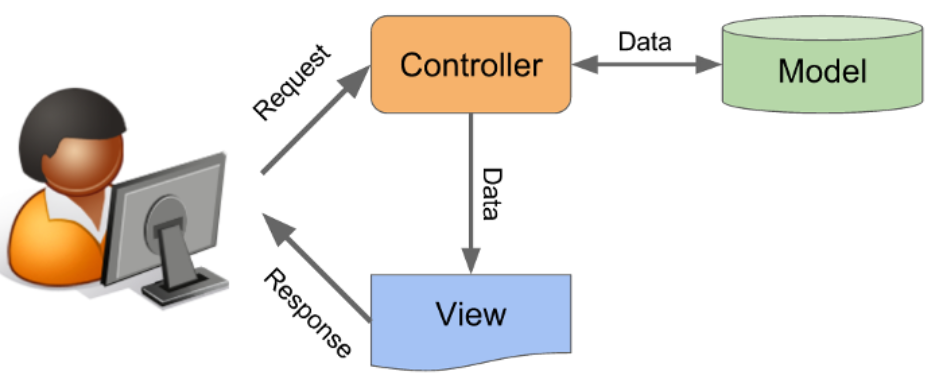

# [BUỔI 11] - CÁC NGUYÊN TẮC THIẾT KẾ, MÔ HÌNH THIẾT KẾ

## 1. Solid là gì?
SOLID là viết tắt của 5 chữ cái đầu trong 5 nguyên tắc thiết kế hướng đối tượng. Giúp cho lập trình viên viết ra những đoạn code dễ đọc, dễ hiểu, dễ maintain.

5 nguyên tắc đó bao gồm:

- Single responsibility priciple (SRP)
- Open/Closed principle (OCP)
- Liskov substitution principe (LSP)
- Interface segregation principle (ISP)
- Dependency inversion principle (DIP)

Chúng ta sẽ tìm hiểu về 3 nguyên tắc đầu tiên:

### 1.1. Single responsibility priciple (Nguyên tắc đơn nhiệm)
>Một class chỉ nên giữ 1 trách nhiệm duy nhất, chỉ có thể sửa đổi class với 1 lý do duy nhất.

Một class có quá nhiều chức năng sẽ trở nên cồng kềnh và trở nên khó đọc, khó maintain. Mà đối với ngành IT việc requirement thay đổi, cần thêm sửa chức năng là rất bình thường, nên việc code trong sáng, dễ đọc dễ hiểu là rất cần thiết.

### 1.2. Open-Closed principle (OCP) – Nguyên lý đóng mở
>Có thể thoải mái mở rộng 1 class, nhưng không được sửa đổi bên trong class đó.

Chúng ta không được thay đổi hiện trạng của các lớp có sẵn, nếu muốn thêm tính năng mới, thì hãy mở rộng class cũ bằng cách kế thừa để xây dựng class mới. Làm như vậy sẽ tránh được các tình huống làm hỏng tính ổn định của chương trình đang có.

Ví dụ:
Class Book:
```java
public class Book {
    private String name;
    private int yearOfPublish, pages;
    private int price;
}
```

Muốn định giá sách, nếu trên 100 trang thì x2 giá tiền:
```java
public class Book {
    String name, typeOfBook;
    int pages;

    private int price;
    int valuate()
    {
        if(this.typeOfBook.equals("Novel") && this.pages > 100) return (this.price * 2);
        return this.price;
    }
    Book(String name, String typeOfBook, int pages, int price)
    {
        this.typeOfBook = typeOfBook;
        this.name = name;
        this.pages = pages;
        this.price = valuate();
    }
}
```
Cách làm này đúng nhưng sai với nguyên tắc Open-Closed. Giả dụ nếu muốn thêm kiểu định giá khác với loại sách khác, chúng ta lại phải vào sửa hàm valuate().

- Chúng ta cần tạo nhiều class loại sách kế thừ từ Book
```java

public class Novel extends Book {

    private int price;

    public int getPrice() {
        return price;
    }

    public void setPrice(int price) {
        this.price = price;
    }

    Novel(String name, int pages, int price)
    {
        super(name, pages);
        if(pages > 100) this.price = price * 2;
        else this.price = price;
    }
}
```

### 1.3. The Liskov Substition Principle (Nguyên tắc phân vùng Liskov)

Trong một chương trình, các object của class con có thể thay thế class cha mà không làm thay đổi tính đúng đắn của chương trình. 

Ví dụ khi ta muốn viết một chương trình để mô tả các loài chim bay được nhưng chim cánh cụt không bay được. Vì vậy khi viết đến hàm chim cánh cụt thì khi gọi hàm bay của chim cánh cụt, ta sẽ quăng NoFlyException.

Class Bird.java:
```java
public class Bird {
    public void fly() throws NoFlyException {
        System.out.println("Weeeeeeee");
    }
}
```
Class Penguin.java:
```java
class NoFlyException extends Exception{
    NoFlyException(String s)
    {
        super(s);
    }
}

public class Penguin extends Bird{
    @Override
    public void fly() throws NoFlyException {
        throw new NoFlyException("Penguin cannot fly");
    }

    public static void main(String[] args) throws NoFlyException{
        Penguin penguin = new Penguin();
        penguin.fly();
    }
}
```

## 2. KISS, DRY, YAGNI
### 2.1. Nguyên tắc KISS
KISS = Keep It Simple Stupid

KISS có nhiều biến thể khác nhau như "Keep It Short and Simple", "Keep It Simple and Straightforward" và "Keep It Small and Simple".

Tóm lại, hàm ý của nó vẫn hướng về một sự đơn giản và rõ ràng trong mọi vấn đề. Và như vậy, sự đơn giản là mục đích trọng tâm trong thiết kế, còn những cái phức tạp không cần thiết thì nên tránh.

Trong lập trình, KISS nghĩa là hãy làm cho mọi thứ (mã lệnh của bạn) trở nên đơn giản và dễ nhìn hơn. Hãy chia nhỏ vấn đề và giải quyết từng cái. Hãy để số lượng dòng code của một lớp hay phương thức ở con số hàng chục thôi.

Đừng viết những lớp hay phương thức theo kiểu tổng hợp hay lẫn lộn (tất cả trong một), hãy để mọi thứ thật đơn giản để bạn luôn có thể hiểu được, và kết hợp chúng với nhau để giải quyết được các bài toán lớn.

### 2.2. Nguyên tắc DRY:
DRY = Don’t Repeat Yourself

Nguyên tắc này có nghĩa là đừng có viết lặp bất kỳ lại một đoạn mã nào mà hãy đóng gói nó thành phương thức riêng. Đến khi cần thì chỉ cần gọi tên nó ra.

Nguyên tắc này nó giống như tính chất kế thừa trong lập trình hướng đối tượng OOP mà chúng ta đã quá quen thuộc rồi.

### 2.3. Nguyên tắc YAGNI:
YAGNI = You Aren’t Gonna Need It

Nguyên tắc này là dự án của bạn đang làm thì chỉ cần tập trung xây dựng chức năng quyết vấn đề ở thời điểm hiện tại, vấn đề mà khách hàng cần giải quyết, không cần lãng phí thời gian vào một chức năng "Có thể sử dụng đến".

=>  Đừng tự vẽ việc cho mình.

## 3.Mô hình MVC

MVC là viết tắt của cụm từ “Model-View-Controller“. Đây là mô hình thiết kế được sử dụng trong kỹ thuật phần mềm. MVC là một mẫu kiến trúc phần mềm để tạo lập giao diện người dùng trên máy tính.

Mô hình MVC (MVC pattern) thường được dùng để phát triển giao diện người dùng. Nó cung cấp các thành phần cơ bản để thiết kế một chương trình cho máy tính hoặc điện thoại di động, cũng như là các ứng dụng web.

Mô hình MVC gồm 3 loại chính là thành phần bên trong không thể thiếu khi áp dụng mô hình này:

- Model: Là bộ phận có chức năng **lưu trữ toàn bộ dữ liệu của ứng dụng** và là cầu nối giữa 2 thành phần bên dưới là View và Controller. Một model là dữ liệu được sử dụng bởi chương trình. Đây có thể là cơ sở dữ liệu, hoặc file XML bình thường hay một đối tượng đơn giản. Chẳng hạn như biểu tượng hay là một nhân vật trong game.
- View: Đây là phần **giao diện (theme)** dành cho người sử dụng. View là phương tiện hiển thị các đối tượng trong một ứng dụng. Chẳng hạn như hiển thị một cửa sổ, nút hay văn bản trong một cửa sổ khác. Nó bao gồm bất cứ thứ gì mà người dùng có thể nhìn thấy được.
- Controller: Là bộ phận có nhiệm vụ **xử lý các yêu cầu người dùng đưa đến** thông qua View. Một controller bao gồm cả Model lẫn View. Nó nhận input và thực hiện các update tương ứng.

### Luồng xử lý trong MVC
- Khi một yêu cầu của từ máy khách (Client) gửi đến Server. Thì bị Controller trong MVC chặn lại để xem đó là URL request hay sự kiện.
- Sau đó, Controller xử lý input của user rồi giao tiếp với Model trong MVC.
- Model chuẩn bị data và gửi lại cho Controller.
- Cuối cùng, khi xử lý xong yêu cầu thì Controller gửi dữ liệu trở lại View và hiển thị cho người dùng trên trình duyệt.


Ở đây, View không giao tiếp trực tiếp với Model. Sự tương tác giữa View và Model sẽ chỉ được xử lý bởi Controller.

Ví dụ: Quản lí đăng nhập tài khoản:

**Model:**
```java
public class LoginModel{
    private String userName;
    private String userPassword;
    public LoginModel(){

    }

    public LoginModel(String userName, String userPassword)
    {
        super();
        this.userName = userName;
        this.userPassword = userPassword;
    }

    public String getUserName() {
        return userName;
    }

    public void setUserName(String userName) {
        this.userName = userName;
    }

    public String getUserPassword() {
        return userPassword;
    }

    public void setUserPassword(String userPassword) {
        this.userPassword = userPassword;
    }
}
```

**View:**
Đối với thành phần này có 2 phương thức để tạo View trong MVC mà các lập trình có thể ứng dụng:

- ShowMessage(): Có tính năng hiển thị thông tin cho người sử dụng.
- GetUserInfo(): dùng để thu thập thông tin user mà người dùng đăng nhập vào web.

```java
import java.util.Scanner;

public class LoginView{
    public static Scanner scanner = new Scanner(System.in);

    public void showMessages(String message)
    {
        System.out.println(message);
    }

    public LoginModel getUserInfo(){
        LoginModel user = new LoginModel();
        System.out.println("Username: ");
        user.setUserName(scanner.next());
        System.out.println("Password: ");
        user.setUserPassword(scanner.next());
        return user;
    }
}
```

**Controller:**

Kiểm tra tài khoản và mật khẩu người dùng trong Controller. Nếu thông tin chính xác nghĩa là sẽ đăng nhập thành công.
```java
public class LoginController{
    private LoginView loginView;

    public LoginController(LoginView loginView)
    {
        this.loginView = loginView;
    }

    public void login()
    {
        while(true)
        {
            LoginModel user = loginView.getUserInfo();
            if(checkLogin(user))
            {
                loginView.showMessages("success");
            }
            else loginView.showMessages("wrong username or password!");
        }
    }

    private boolean checkLogin(LoginModel user)
    {
        if(user.getUserName().equals("admin") && user.getUserPassword().equals("admin"))
        {
            return true;
        }
        return false;
    }

    public LoginView getLoginView()
    {
        return loginView;
    }

    public void setLoginView(LoginView loginView)
    {
        this.loginView = loginView;
    }
}
```

**Main:**
```java
public class Main {
    public static void main(String[] args) {
        LoginView view = new LoginView();
        LoginController controller = new LoginController(view);
        controller.login();
    }
}

```