# [BUỔI 12] - THƯ VIỆN ĐỒ HỌA SWING

## 1. Thư viện đồ họa Swing cơ bản

Java Swing là một phần của Java Foundation Classes (JFC) được sử dụng để tạo các ứng dụng window-based. Nó được xây dựng trên API AWT (Abstract Windowing Toolkit) và được viết hoàn toàn bằng Java.

Không giống như AWT, Java Swing cung cấp các thành phần không phụ thuộc vào nền tảng và nhẹ hơn.

Gói javax.swing cung cấp các lớp cho java swing API như JButton, JTextField, JTextArea, JRadioButton, JCheckbox, JMenu, JColorChooser, v.v.

### Phân cấp các lớp Java Swing

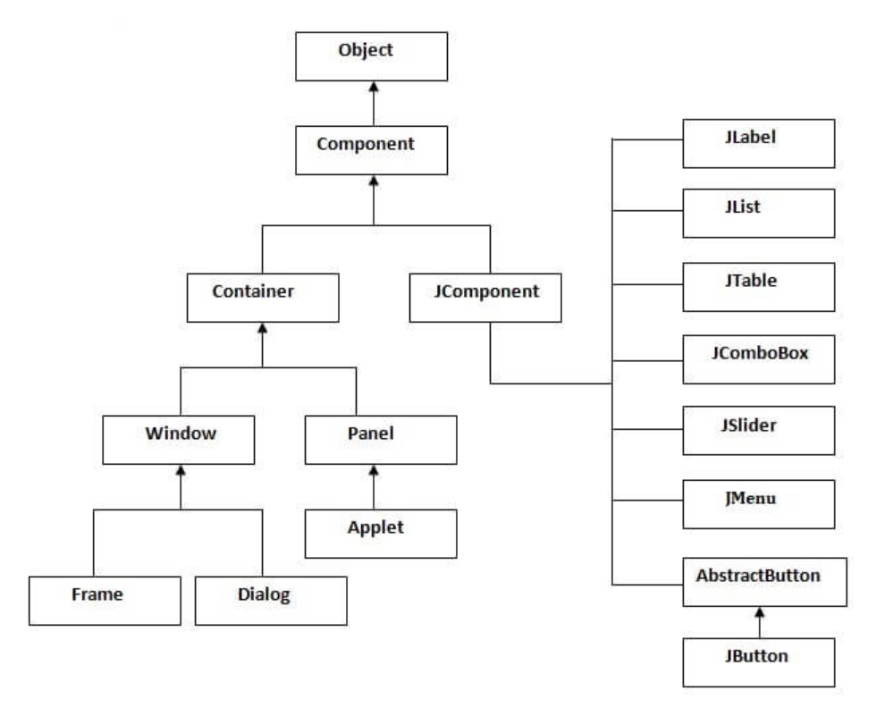

### Các phương thức thường dùng của lớp Component

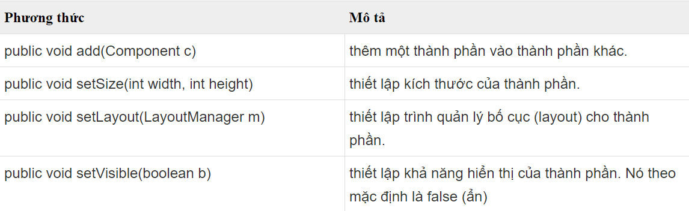

## 2. Một số thành phần cơ bản

### JFrame
JFrame là một container(Nơi chứa và sắp xếp các component khác của Java Swing, có thể là các container khác) trong ứng dụng Java Swing, nó được dùng để chứa và sắp xếp các phần con như Button, Label, TextField, etc. Có thể đây là nơi bắt đầu của mọi ứng dụng Swing.
```java
import javax.swing.*;

public class Hello{
    Hello()
    {
        JFrame frame = new JFrame("Hello");
        frame.setSize(400, 400);
        frame.setVisible(true);
    }

    public static void main(String[] args) {
        Hello hello = new Hello();
    }
}
```
Kết quả:

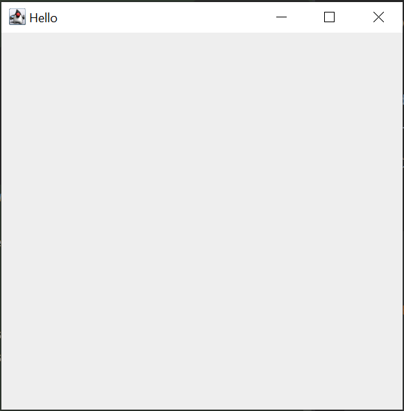

#### Xử lý khi JFrame bị đóng
Khi một JFrame được khởi tạo, cho đến khi người dùng tắt JFrame này thì chúng ta có thể định nghĩa các hành động tương ứng mà chúng ta muốn trong giai đoạn này. Java Swing cung cấp 4 hằng số tương ứng với 4 loại hành động sau khi một JFrame bị đóng. Các hằng số này được định nghĩa trong trong avax.swing.WindowsConstants:

- DO_NOTHING_ON_CLOSE– Không làm thêm bất cứ điều gì khi JFrame bị đóng
- HIDE_ON_CLOSE – JFrame sẽ bị ẩn đi khi người dùng đóng nó lại. Chương trình vẫn sẽ hoạt động bình thường trong khi JFrame này bị ẩn. Đây là một hành động mặc định của JFrame.
- DISPOSE_ON_CLOSE – Sau khi bị đóng lại, nó đồng thời sẽ bị dọn dẹp rác, các tài nguyên được JFrame này sử dụng sẽ bị thu hồi nhường chỗ cho những nơi khác sử dụng.
- EXIT_ON_CLOSE – Sau khi JFrame bị đóng, chương trình cũng sẽ tắt theo.
Chúng ta có thể đặt hành vi đóng mặc định của JFrame bằng cách chuyển một trong bốn hằng số vào phương thức setDefaultCloseOperation () của nó
```java
    frame.setDefaultCloseOperation(JFrame.EXIT_ON_CLOSE);
```
### JButton
Nó được dùng để tạo ra một nút (button) có tên.

Việc sử dụng ActionListener sẽ dẫn đến một số hành động khi nút được nhấn.

Nó kế thừa lớp AbstractButton và độc lập với nền tảng.

VD:
```java
import javax.swing.*;

public class Hello{
    public static void main(String[] args) {
        JFrame frame = new JFrame("Hello");
        JButton button = new JButton("click here", new ImageIcon("C:\\Users\\dell\\Downloads\\ảnh linh tinh\\gộ.jpg"));
        button.setBounds(130, 50, 600, 600);
        frame.add(button);
        frame.setSize(400, 400);
        frame.setLayout(null);
        frame.setVisible(true);
        frame.setDefaultCloseOperation(WindowConstants.EXIT_ON_CLOSE);
    }
}
```
Kết quả:

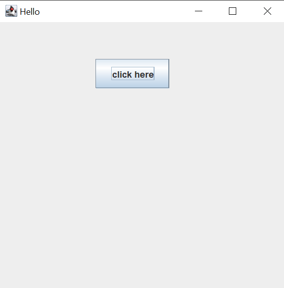

#### Tạo Button với Icon Trong Swing
Mặc định thì khi khởi tạo một JButton chỉ có đoạn văn bảng đại diện cho Button, chúng ta có thể thêm các hình ảnh vào Button cho sinh động đẹp mắt thêm như sau. 

- Button chỉ chứa hình:
```java
    JButton button = new JButton(new ImageIcon("images/start.gif"));
```
VD:
```java
import javax.swing.*;

public class Hello{
    public static void main(String[] args) {
        JFrame frame = new JFrame("Hello");
        JButton button = new JButton(new ImageIcon("C:\\Users\\dell\\Downloads\\ảnh linh tinh\\gộ.jpg"));
        button.setBounds(130, 50, 600, 600);
        frame.add(button);
        frame.setSize(400, 400);
        frame.setLayout(null);
        frame.setVisible(true);
        frame.setDefaultCloseOperation(WindowConstants.EXIT_ON_CLOSE);
    }
}
```
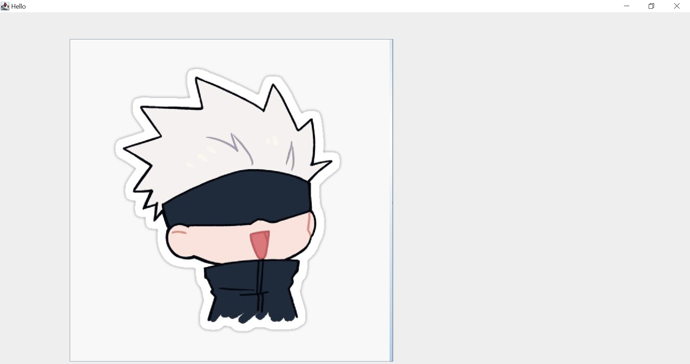

- Button chứa cả hình và chữ:
```java
    JButton button = new JButton("Start", new ImageIcon("images/start.gif"));
```

### JLabel
Lớp JLabel trong Java Swing có thể hiển thị hoặc text, hoặc hình ảnh hoặc cả hai. Các nội dung của Label được gán bởi thiết lập căn chỉnh ngang và dọc trong khu vực hiển thị của nó. Theo mặc định, các label được căn chỉnh theo chiều dọc trong khu vực hiển thị. Theo mặc định, text-only label là căn chỉnh theo cạnh, image-only label là căn chỉnh theo chiều ngang.

VD:
```java
import javax.swing.*;

public class Hello{
    public static void main(String[] args) {
        JFrame frame = new JFrame("Bro");
        frame.setVisible(true);
        frame.setSize(400, 400);
        frame.setDefaultCloseOperation(WindowConstants.EXIT_ON_CLOSE);

        ImageIcon image = new ImageIcon("src\\img.png");

        JLabel label = new JLabel("Hi Bro");
        label.setIcon(image);

        frame.add(label);
    }
}
```

Kết quả:

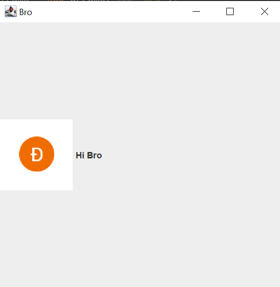

### JTextField
JTextField là một component cho phép nhập và chỉnh sữa đoạn văn bản trên cùng một dòng vì thế nó thường phù hợp cho việc nhập, chỉnh sửa các thông tin dạng ngắn gọn, mang đại ý như là email, password, tên công ty, tên sinh viên, etc.

> Trong JTextField có một thuộc tính gọi là columns được dùng để tính toán độ rộng của JTextField, mặc định nó là 0 nên khi không có dữ liệu thì kích thước của nó sẽ rất nhỏ. Để chỉ định columns cho JTextField chúng ta có thể khởi tạo như sau:
> ```java
> JTextField textField = new JTextField(20);
> ```


```java
import javax.swing.*;

public class TestJava{

    public static void main(String[] agrs) {
        JFrame frame = new JFrame("Van");
        frame.setVisible(true);
        frame.setSize(400, 150);

        JPanel panel = new JPanel();

        JTextField textField = new JTextField(10);
        panel.add(textField);
        frame.add(panel);
        frame.setDefaultCloseOperation(WindowConstants.EXIT_ON_CLOSE);
    }
}
```

### JTable

JTable là một trong những thành phần quan trọng của Java Swing package được sử dụng để hiển thị và chỉnh sửa dữ liệu theo dạng Table (Dữ liệu được trình bày theo dạng hàng và cột). Nó tương tự như một bảng tính trong excel file.

**JTable cung cấp một số constructor cho phép khởi tạo một JTable instance như sau:**

- JTable() – Khởi tạo một JTable rỗng.
- JTable(int rows, int cols) – Khởi tạo một JTable với số dòng và cột được chỉ định.
- JTable(Object[][] data, Object []Column) – Khởi tạo một Jtable với các tên cột được chỉ định trong Object[] Column và dữ liệu trong Object[][] data.

**Một số hàm thường xuyên sử dụng trong JTable:**

- addColumn(TableColumn column) – Thêm một cột vào cuối bảng.
- editCellAt(int row, int col) – Chỉnh sửa ô giao nhau của cột số col và hàng số row, nếu các chỉ số đã cho hợp lệ và ô tương ứng có thể chỉnh sửa được. 
- setValueAt(Object value, int row, int col) – Cập nhật giá trị tạo ô có số cột là col và hàng row thành giá trị value mới. 
- clearSelection() – Bỏ chọn tất cả các cột và hàng trước đó đã được chọn.

VD:
```java
import javax.swing.*;

public class TestJava{

    public static void main(String[] agrs) {
        JFrame frame = new JFrame();

        String[][] data = {
                {"Van Doang", "Cap Cap"},
                {"Phan Tham", "Cap Cap"}
        };

        String[] name = {"Ten", "Cung Hoang Dao"};

        JTable table = new JTable(data, name);
        table.setBounds(30, 40, 200, 300);

        JScrollPane sp = new JScrollPane(table);
        frame.add(sp);

        frame.setSize(500, 200);
        frame.setVisible(true);
        frame.setLocationRelativeTo(null);
        frame.setDefaultCloseOperation(WindowConstants.EXIT_ON_CLOSE);
    }
}
```
Kết quả:

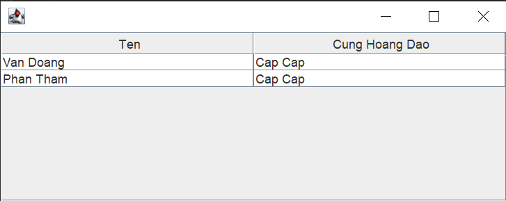

### JList
JList giúp hiển thị một tập hợp các phần tử và cho phép người dùng có thể chọn một hoặc nhiều phần tử trong số chúng. 

**Để tạo một đối tượng JList trong Swing chúng ta có thể sử dụng một trong số constructor sau:**

- JList() – Tạo JList rỗng.
- JList(E[] items) – Tạo một JList với các phần tử items được chỉ định trong mảng.
- JList(ListModel model) – Tạo một JList với Model được chỉ định sẵn.
- JList(Vector items) – Tạo một JList với các phần tử items được chỉ định trong Vector.

**Một số hàm thường xuyên sử dụng trong JList:**

1. getSelectedIndex() – Trả về vị trí của phần tử đang được chọn.
2. getSelectedValue() – Trả về giá trị của phần tử đang được chọn.
3. setSelectedIndex(int i) – Chọn phần tử tại vị trí i.
4. setSelectionBackground(Color c) – Thay đổi màu nền của phần tử đang được chọn.
5. setSelectionForeground(Color c) – Thay đổi màu chữ của phần tử đang được chọn.
6. setListData(E [ ] l) – Đặt danh sách các phần tử mới trong mảng vào JList, các phần tử đang tồn tại trong Jlist sẽ bị thay thế.
7. setVisibleRowCount(int v) – Thay đổi visibleRowCount.
8. setSelectedValue(Object a, boolean s) – Chọn phần tử dựa vào giá trị.
9. setListData(Vector l) – Đặt danh sách các phần tử mới trong vector vào JList, các phần tử đang tồn tại trong Jlist sẽ bị thay thế.
10. getSelectedValuesList() – Trả về danh sách các phần tử đang được chọn.
11. getMinSelectionIndex() – Trả về vị trí nhỏ nhất của phần tử được chọn, -1 nếu không có phần tử nào được chọn.
12. getMaxSelectionIndex() – Trả về vị trí lớn nhất của phần tử được chọn, -1 nếu không có phần tử nào được chọn.
13. getLastVisibleIndex() – Trả về vị trí lớn nhất của phần tử trong JList.

```java
import javax.swing.*;
import java.awt.*;

public class TestJava{

    public static void main(String[] agrs) {
        JFrame frame = new JFrame();

        String[] week = {"Monday", "Tuesday", "Wednesday",
                "Thursday", "Friday", "Saturday", "Sunday"};

        JList list = new JList(week);
        list.setSelectionBackground(Color.BLUE);

        list.setSelectedIndex(2);

        frame.add(list);
        frame.setSize(500, 200);
        frame.setVisible(true);
        frame.setLocationRelativeTo(null);
        frame.setDefaultCloseOperation(WindowConstants.EXIT_ON_CLOSE);
    }
}
```

Kết quả:

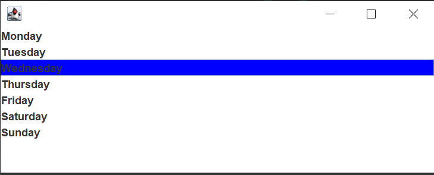

## 3. Layout
Layout (bố cục) nghĩa là sự bố trí sắp xếp các thành phần bên trong Container theo một phương thức nhất định. Nói cách khác, chúng ta đặt các thành phần tại một vị trí cụ thể bên trong Container. Tác vụ bố trí này được thực hiện tự động bởi LayoutManager. Nếu chúng ta không sử dụng LayoutManager thì các thành phần cũng sẽ được tự động bố trí bởi LayoutManager mặc định. Tuy nhiên, để xử lý một số lượng thành phần lớn với kích cỡ, hình dạng khác nhau và muốn chúng được bố trí theo cách bạn muốn thì việc sử dụng các LayoutManager là cần thiết.

### BorderLayout
Lớp BorderLayout trong Java Swing sắp xếp các thành phần để phù hợp với 5 miền: EAST, WEST, SOUTH, NORTH và CENTER. Nó là layout mặc định của Frame hoặc Window. Mỗi khu vực (miền) chỉ có thể chứa một thành phần và mỗi thành phần trong mỗi khu vực được nhận diện bởi các hằng tương ứng là:

```
public static final int NORTH
 
public static final int SOUTH
 
public static final int EAST
 
public static final int WEST
 
public static final int CENTER
```

VD:
```java
import javax.swing.*;
import java.awt.*;

public class TestJava{

    public static void main(String[] agrs) {
        JFrame frame = new JFrame("Layout");

        JButton b1 = new JButton("NORTH");
        JButton b2 = new JButton("WEST");
        JButton b3 = new JButton("EAST");
        JButton b4 = new JButton("SOUTH");
        JButton b5 = new JButton("CENTER");


        frame.setLayout(new BorderLayout());
        frame.add(b1, BorderLayout.NORTH);
        frame.add(b2, BorderLayout.WEST);
        frame.add(b3, BorderLayout.EAST);
        frame.add(b4, BorderLayout.SOUTH);
        frame.add(b5, BorderLayout.CENTER);

        frame.setVisible(true);
        frame.setSize(200, 200);
        frame.setDefaultCloseOperation(WindowConstants.EXIT_ON_CLOSE);

    }
}
```

Kết quả:

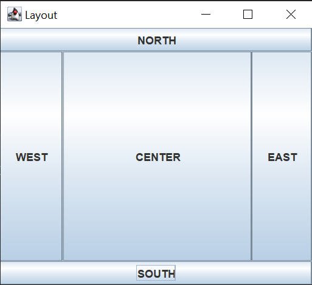

### FlowLayout
FlowLayout bố trí các thành phần con theo hướng từ trái sang phải hoặc từ phải sang trái trên cùng một dòng. Nếu tất cả các thành phần con không thể chứa trên cùng một dòng so với chiều dài tối đa của container thì chúng sẽ được sắp xếp trên một hàng mới.

#### Lớp FlowLayout này bao gồm các trường sau:
- **static int CENTER**: Giá trị này chỉ rằng mỗi hàng của các thành phần nên được căn chỉnh vào giữa.

- **static int LEADING**: Giá trị này chỉ rằng mỗi hàng của các thành phần nên được căn chỉnh theo cạnh chủ đạo (leading edge) theo hướng của container, ví dụ: căn chỉnh theo cạnh trái theo hướng left-to-right.

- **static int LEFT**: Giá trị này chỉ rằng mỗi hàng của các thành phần nên được căn chỉnh trái.

- **static int RIGHT**: Giá trị này chỉ rằng mỗi hàng của các thành phần nên được căn chỉnh phải.

- **static int TRAILING**: Giá trị này chỉ rằng mỗi hàng của các thành phần nên được căn chỉnh theo cạnh trailing edge theo hướng của container, ví dụ: căn chỉnh theo cạnh phải theo hướng left-to-right.

#### Các constructor được sử dụng phổ biến của lớp FlowLayout
**FlowLayout()**: tạo một Flow Layout với căn chỉnh trung tâm và một khoảng cách gap theo chiều dọc và ngang là 5 đơn vị.

**FlowLayout(int align)**: tạo một Flow Layout với căn chỉnh align đã cho và một khoảng cách gap theo chiều dọc và ngang là 5 đơn vị.

**FlowLayout(int align, int hgap, int vgap)**: tạo một Flow Layout với căn chỉnh align đã cho và một khoảng cách gap theo chiều dọc và ngang đã được xác định.
VD:
```java
import javax.swing.*;
import java.awt.*;

public class TestJava{

    public static void main(String[] agrs) {
        JFrame frame = new JFrame("Layout");
        FlowLayout flowLayout = new FlowLayout(FlowLayout.CENTER);

        JButton b1 = new JButton("First");
        JButton b2 = new JButton("Second");
        JButton b3 = new JButton("Third");

//        frame.setLayout(new FlowLayout(FlowLayout.CENTER)); //Có thể làm cách này
        frame.setLayout(flowLayout);
        frame.add(b1);
        frame.add(b2);
        frame.add(b3);

        frame.setVisible(true);
        frame.setSize(400, 400);
        frame.setDefaultCloseOperation(WindowConstants.EXIT_ON_CLOSE);

    }
}
```

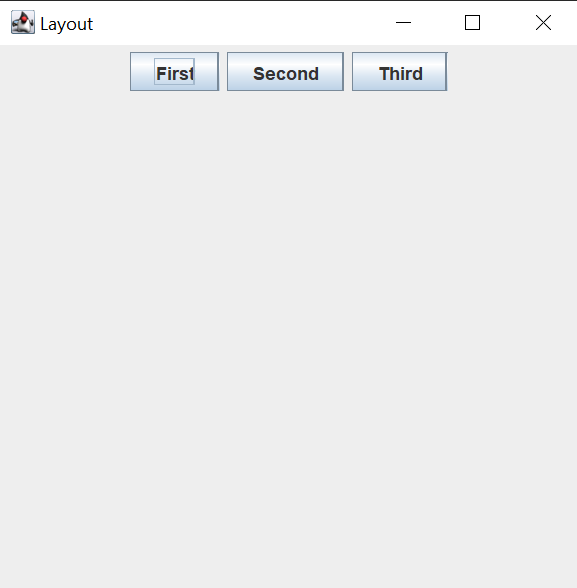

### GridLayout
Trình quản lý GridLayout được sử dụng để bố trí các thành phần trong một lưới hình chữ nhật, lưới này đã được chia thành các hình chữ nhật có kích thước bằng nhau và một thành phần được đặt trong mỗi hình chữ nhật. 

#### Chúng ta có thể khởi tạo GridLayout thông qua các constructor sau:

- **GridLayout()** – Tạo GridLayout với duy nhất một dòng và một cột
- **GridLayout(int row, int col)** – Tạo GridLayout với row dòng và col cột.
- **GridLayout(int row, int col, int hgap, int vgap)** – Tạo GridLayout với row dòng và col cột, các phần tử trên cùng một dòng cách nhau hgap và trên cùng một cột cách nhau vgap.

```java
import javax.swing.*;
import java.awt.*;

public class TestJava{

    public static void main(String[] agrs) {
        JFrame frame = new JFrame("Layout");
        GridLayout gridLayout = new GridLayout(3, 2);
        JPanel panel = new JPanel();

        JButton b1 = new JButton("First");
        JButton b2 = new JButton("Second");
        JButton b3 = new JButton("Third");
        JButton b4 = new JButton("Fourth");
        JButton b5 = new JButton("Fifth");

        panel.setLayout(gridLayout);
        panel.add(b1);
        panel.add(b2);
        panel.add(b3);
        panel.add(b4);
        panel.add(b5);

        frame.add(panel);
        frame.setVisible(true);
        frame.setSize(400, 400);
        JFrame.setDefaultLookAndFeelDecorated(true);
        frame.setDefaultCloseOperation(WindowConstants.EXIT_ON_CLOSE);

    }
}
```
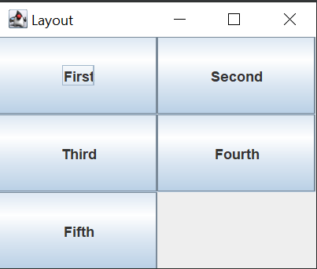

## 4. Graphics2D, Image

### Graphics2D

**Cơ chế paint**
Code paint tùy chỉnh nên đặt trong phương thức paintComponent(). Phương thức được gọi khi vẽ. Hệ thống con paint gọi phương thức paint() đầu tiên. Phương thức này gọi 3 phương thức sau:
- paintComponent()
- paintBorder()
- paintChildren()

Trong trường hợp cụ thể, chúng ta có thể muốn override phương thức paintBorder() hoặc paintChildren(). Trong hầu hết các trường hợp, chúng ta override phương thức paintComponent().

**Object Graphics**

Tham số duy nhất của paintComponent là 1 object Graphics. Nó cho biết số lượng phương thức vẽ hình 2D và lấy thông tin về môi trường graphics của ứng dụng. Class ‘Graphics2D’ kế thừa class ‘Graphics’ để cung cấp kiểm soát hình học tinh vi hơn, chuyển hệ tọa độ, quản lý màu và layout text.

Object ‘Graphics’ được khởi tạo trước khi nó được truyền vào phương thức paintComponent() và sau đó nó được chuyển đến các phương thức paintBorder() và paintChildren(). Việc tái sử dụng cải tiến performance nhưng nó dẫn đến problem nếu code painting thay đổi vĩnh viễn trạng thái của object ‘Graphics’. Do đó, chúng ta phải hoặc là khôi phục setting ban đầu hoặc làm việc với bản copy của object ‘Graphics’. Bản copy được tạo với phương thức create() của class ‘Graphics’. Nó phải được giải phóng (release) với phương thức dispose().

Trong thực tế, bản copy của object Graphics’ không cần được tạo nếu chúng ta set thuộc tính sau: font, color, render hints. Về các đặc tính khác (đặc biệt là hoạt động clip, hỗn hợp và biến đổi ), chúng ta phải tạo bản copy của object ‘Graphics’.

Graphics2D là một lớp trong Java mở rộng từ lớp Graphics để cung cấp kiểm soát phức tạp hơn về hình học, biến đổi tọa độ, quản lý màu sắc và bố trí văn bản. Đây là lớp cơ bản để vẽ hình dạng 2 chiều, văn bản và hình ảnh trên nền tảng Java

VD về Graphics2D:
```java
import javax.swing.*;
import java.awt.*;

public class Surface extends JPanel {

    private void drawing(Graphics g) {
        Graphics2D graphics2D = (Graphics2D) g;
        g.setColor(Color.RED);
        graphics2D.fillOval(0, 0, 50, 50);
    }

    public void paintComponent(Graphics g) {
        super.paintComponent(g);
        drawing(g);
    }

}
```
```java
import javax.swing.*;
import java.awt.*;

public class Frame{
    private void draw()
    {
        JFrame frame = new JFrame("Draw an Oval");
        frame.add(new Surface());
        frame.setSize(300, 300);
        frame.setVisible(true);
        frame.setDefaultCloseOperation(WindowConstants.EXIT_ON_CLOSE);
    }

    public static void main(String[] args) {
        Frame newFrame = new Frame();
        newFrame.draw();
    }
}
```

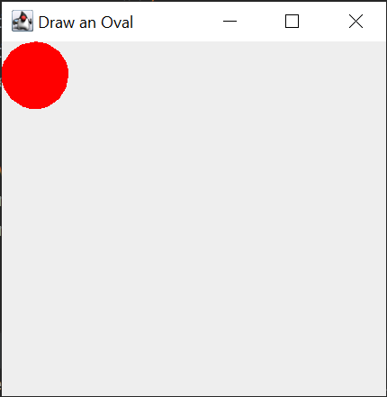

### Image
Lớp Image trong Java là một lớp trừu tượng (abstract superclass) đại diện cho tất cả các lớp khác được sử dụng để biểu diễn hình ảnh đồ họa.

```java
import javax.swing.*;

public class Hello{
    public static void main(String[] args) {
        JFrame frame = new JFrame("Hello");
        JButton button = new JButton(new ImageIcon("C:\\Users\\dell\\Downloads\\ảnh linh tinh\\gộ.jpg"));
        button.setBounds(130, 50, 600, 600);
        frame.add(button);
        frame.setSize(400, 400);
        frame.setLayout(null);
        frame.setVisible(true);
        frame.setDefaultCloseOperation(WindowConstants.EXIT_ON_CLOSE);
    }
}

```

