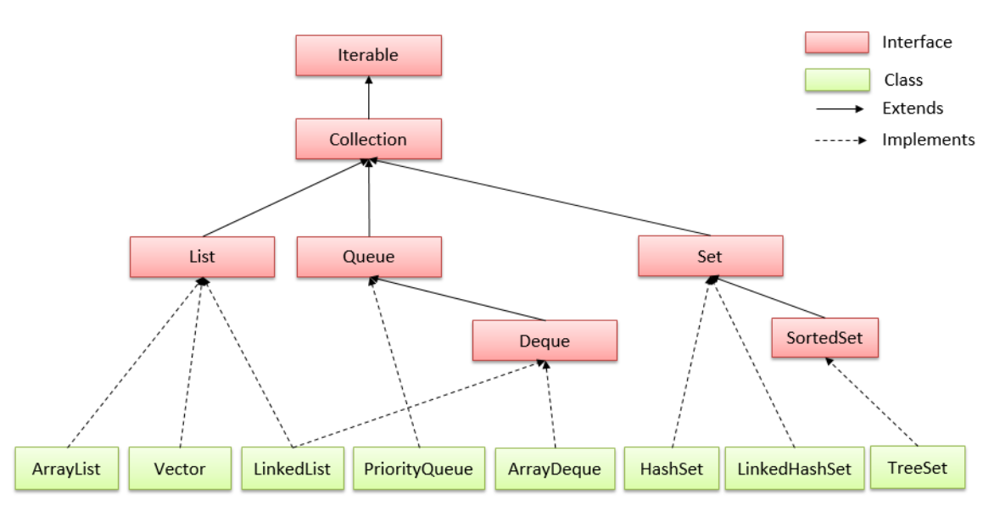
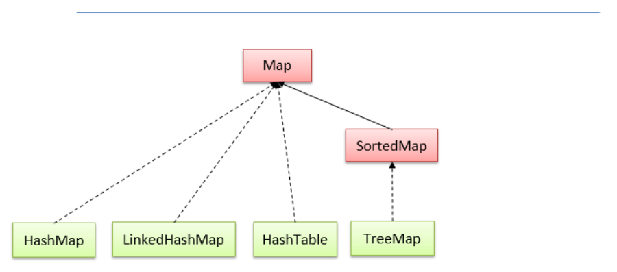
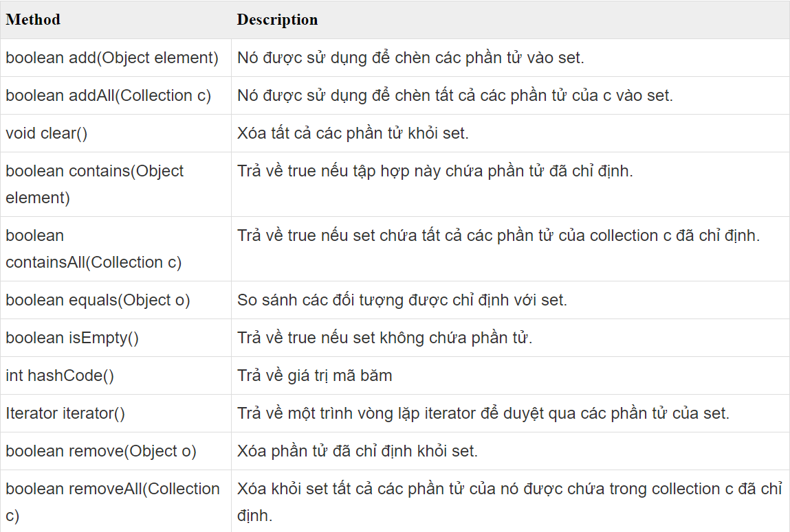
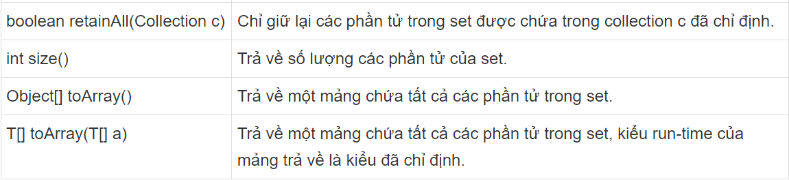
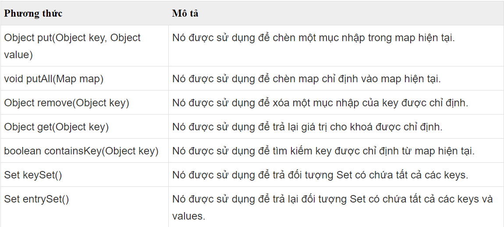
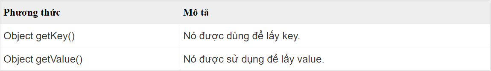
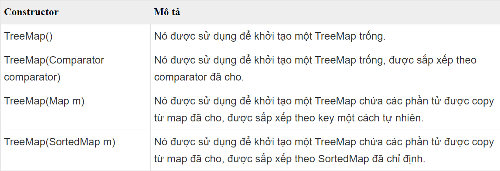

# [BUỔI 8] MỘT SỐ CẤU TRÚC DỮ LIỆU THƯỜNG THẤY TRONG JAVA

## 1. Cấu trúc dữ liệu là gì? Sử dụng khi nào?
Cấu trúc dữ liệu là một hình thức tổ chức, lưu trữ dữ liệu theo hệ thống và thứ tự để có thể sử dụng tài liệu một cách tối ưu.

Sự chọn lựa giữa các cấu trúc dữ liệu khác nhau thường phụ thuộc vào nhu cầu cụ thể của vấn đề bạn đang giải quyết và các yêu cầu về thời gian và không gian.

Dưới đây là một số trường hợp khi bạn nên sử dụng cấu trúc dữ liệu:

+ Tìm kiếm nhanh

+ Chèn và xóa hiệu quả

+ Duyệt tuần tự

+ Phân loại và xử lý đồng thời

+ Đồ thị và mạng

+ Quản lý dữ liệu có cấu trúc phức tạp

+ Đảm bảo tính toàn vẹn dữ liệu

+ Tiết kiệm bộ nhớ

## 2. Iterable Interface, Collection -> List, Set, Queue

### 2.1 Khái niệm cơ bản về Iterable
Trong Java, Iterable là một giao diện (interface) được định nghĩa trong gói java.lang. Giao diện này chứa một phương thức duy nhất là Iterator< T> iterator(), nơi mà các lớp triển khai phải cung cấp một trình duyệt (iterator) để duyệt qua các phần tử của tập hợp. Phương thức này trả về một đối tượng Iterator để lặp qua các phần tử trong tập hợp.

Khi sử dụng Iterable và Iterator, bạn có thể duyệt qua các phần tử của tập hợp một cách thuận tiện bằng cách sử dụng các cấu trúc lặp như vòng lặp while hoặc vòng lặp for-each (enhanced for loop) mà không cần phải quan tâm đến việc cài đặt cụ thể của tập hợp đó.

Ví dụ sử dụng Iterable và Iterator để duyệt qua một danh sách liên kết trong Java:

```java
import java.util.*;

public class Main {
    public static void main(String[] args) {
        List<String> danhSach = new ArrayList<>();
        danhSach.add("Java");
        danhSach.add("Python");
        danhSach.add("C++");

        // Sử dụng Iterable và Iterator để duyệt qua danh sách liên kết
        Iterable<String> iterable = danhSach;
        Iterator<String> iterator = iterable.iterator();
        while (iterator.hasNext()) {
            String phanTu = iterator.next();
            System.out.println(phanTu);
        }
    }
}
```
Kết quả:
```java
Java
Python
C++
```
### 2.2 Iterator
Iterator là một giao diện trong Java, được sử dụng để duyệt qua các phần tử trong một tập hợp dữ liệu (collection) một cách tuần tự. Nó cung cấp các phương thức để truy xuất và quản lý dữ liệu trong tập hợp mà không cần biết chi tiết cài đặt của tập hợp đó. Iterator có thể được sử dụng với bất kỳ tập hợp nào triển khai giao diện Iterable.

Iterator giúp duyệt qua các phần tử trong tập hợp một cách linh hoạt và trừu tượng, không phụ thuộc vào kiểu cụ thể của tập hợp. Nó cho phép ta thực hiện các thao tác duyệt qua các phần tử mà không cần quan tâm đến cấu trúc cài đặt của tập hợp.

Dưới đây là một ví dụ minh họa sử dụng Iterator để duyệt qua một danh sách liên kết:
```java
import java.util.*;

public class Main {
    public static void main(String[] args) {
        List<String> danhSach = new ArrayList<>();
        danhSach.add("Java");
        danhSach.add("Python");
        danhSach.add("C++");

        // Sử dụng Iterator để duyệt qua danh sách liên kết
        Iterator<String> iterator = danhSach.iterator();
        while (iterator.hasNext()) {
            String phanTu = iterator.next();
            System.out.println(phanTu);
        }
    }
}
```
Kết quả:

```java
Java
Python
C++
```

### 2.3 Collection
Collection trong java là một root interface trong hệ thống cấp bậc Collection. Java Collection cung cấp nhiều interface (Set, List, Queue, Deque vv) và các lớp (ArrayList, Vector, LinkedList, PriorityQueue, HashSet, LinkedHashSet, TreeSet vv).

#### Hệ thống cấp bậc Collection trong java




### 2.4 List
List là một interface trong java. Nó chứa các phương thức để chèn và xóa các phần tử dựa trên chỉ số index.

Cấu trúc List là dạng tập hợp các phần tử được sắp theo thứ tự (còn được gọi là dãy tuần tự) và trong đó cho phép lặp (hai phần tử giống nhau). Vì List là một interface, nên chúng ta không thể tạo các đối tượng từ nó. Để sử dụng các tính năng của List interface, chúng ta có thể sử dụng các class sau:

+ ArrayList
+ LinkedList
+ Vector
+ Stack

Khai báo List trong Java:
```java
// ArrayList triển khai List
List<String> list1 = new ArrayList<>();

// LinkedList triển khai List
List<String> list2 = new LinkedList<>();
```
#### Các phương thức của interface List trong java

| Method | Description |
|--------|-------------|
|Object get(int index)        |Cho lại phần tử được xác định bởi index.             |
|Object set(int index, Object elem)        |	Thay thế phần tử được xác định bởi index bằng elem             |
|void add(int index, Object elem)        |Chèn elem vào sau phần tử được xác định bởi index.             |
|Object remove(int index)        |Bỏ đi phần tử được xác định bởi index             |
|boolean addAll(int index, Collection c)        |Chèn các phần tử của tập hợp c vào vị trí được xác định bởi index             |
|int indexOf(Object elem)        |Cho biết vị trí lần xuất hiện đầu tiên của phần tử trong danh sách             |
|            int lastIndexOf(Object elem)                    |Cho biết vị trí lần xuất hiện cuối cùng của elem trong danh sách.                                                                               |
|List subList(int fromIndex, int toIndex)                                |Lấy ra một danh sách con từ vị trí fromIndex đến toIndex                                                                               |
|ListIterator listIterator(int index)                                |Cho lại các phần tử liên tiếp bắt đầu từ phần tử được xác định bởi. Trong đó ListIterator là interface mở rộng giao diện Iterator đã có trong java.lang.                                                                               |

```java
import java.util.ArrayList;
import java.util.List;

public class ListExample {
    public static void main(String args[]) {
        List<String> list = new ArrayList<String>();
        list.add("Java");
        list.add("C++");
        list.add("PHP");
        list.add(1, "Python");
        System.out.println("Phan tu co index = 2 la: " + list.get(2));
        // show list
        for (String s : list) {
            System.out.println(s);
        }
    }
}
```
```java
Phan tu co index = 2 la: C++

Java

Python

C++

PHP
```

#### List Iterator trong java
ListIterator là một interface được sử dụng để duyệt các phần tử của List trong java. Các phương thức của interface ListIterator trong java:


Ví dụ:
```java
import java.util.ArrayList;
import java.util.List;
import java.util.ListIterator;

public class Thaycacac {
    public static void main(String args[]) {
        List<String> list = new ArrayList<String>();
        list.add("Java");
        list.add("C++");
        list.add("PHP");
        list.add(1, "Python");
        System.out.println("Phan tu co index = 2 la: " + list.get(2));

        ListIterator<String> itr = list.listIterator();
        System.out.println("Duyet cac phan tu tu dau den cuoi:");
        while (itr.hasNext()) {
            System.out.println("\t" + itr.next());
        }
        System.out.println("Duyet cac phan tu tu cuoi ve dau:");
        while (itr.hasPrevious()) {
            System.out.println("\t" + itr.previous());
        }
    }
}
```
Kết quả:
```java
Phan tu co index = 2 la: C++

Duyet cac phan tu tu dau den cuoi:

Java

Python

C++

PHP

Duyet cac phan tu tu cuoi ve dau:

PHP

C++

Python

Java
```
### 2.5 Set
Set là một interface kế thừa Collection interface trong java. Set trong java là một Collection không thể chứa các phần tử trùng lặp.

Set được triển khai bởi Hashset, LinkedHashset, Treeset hoặc EnumSet.

+ HashSet lưu trữ các phần tử của nó trong bảng băm, là cách thực hiện tốt nhất, tuy nhiên nó không đảm bảo về thứ tự các phần tử được chèn vào.
+ TreeSet lưu trữ các phần tử của nó trong một cây, sắp xếp các phần tử của nó dựa trên các giá trị của chúng, về cơ bản là chậm hơn HashSet.
+ LinkedHashSet được triển khai dưới dạng bảng băm với có cấu trúc dữ liệu danh sách liên kết, sắp xếp các phần tử của nó dựa trên thứ tự chúng được chèn vào tập hợp (thứ tự chèn).
+ EnumSet là một cài đặt chuyên biệt để sử dụng với các kiểu enum.

#### Khai báo Set trong Java
Vì Set là một (giao diện) interface, bạn cần khởi tạo một triển khai cụ thể của giao diện để sử dụng nó. Về cơ bản bạn có thể chọn các collection sau:

+ HashSet
+ LinkedHashSet
+ TreeSet
+ EnumSet

#### Các phương thức của interface Set trong java



Ví dụ:
```java
import java.util.HashSet;
import java.util.Set;
 
public class SetExam {
    public static void main(String[] args) {
        Set<String> setA = new HashSet<String>();
        setA.add("Java");
        setA.add("Python");
        setA.add("Java");
        setA.add("PHP");
        System.out.println("Số phần tử của setA: " + setA.size());
        System.out.println("Các phần tử của setA: " + setA);
        System.out.println("setA có chứa Java không? " + setA.contains("Java"));
        System.out.println("setA có chứa C++ không? " + setA.contains("C++"));
    }
}
```

Kết quả:
```java
Số phần tử của setA: 3
Các phần tử của setA: [Java, PHP, Python]
setA có chứa Java không? true
setA có chứa C++ không? false
```
### 2.6 Queue

Interface Queue nằm trong package java.util và kế thừa Collection interface. Nó được sử dụng để lưu trữ các phần tử được xử lý theo thứ tự FIFO (First In First Out).
Các phương thức trong Queue interface

- boolean add(object): Thêm phần tử được chỉ định vào Queue. Nếu thêm thành công trả về true, ngược lại nó sẽ ném ra ngoại lệ
- boolean offer(object): Thêm phần tử được chỉ định vào Queue. Nếu thêm thành công trả về true, ngược lại trả về false
- Object remove(): Trả về phần tử đầu tiên và xóa phần tử đó.Nếu queue trống sẽ ném ra ngoại lệ
- Object poll(): Trả về phần tử đầu tiên và xóa phần tử đó. Nếu queue trống sẽ trả về null
- Object element(): Trả về phần tử đầu tiên của queue. Nếu queue trống sẽ ném ra ngoại lệ
- Object peek(): Trả về phần tử đầu tiên của queue. Nếu queue trống sẽ trả về null
#### Đặc điểm của queue

- Queue được sử dụng để thêm phần tử vào cuối danh sách và loại bỏ phần tử đầu tiên của danh sách. Nó tuân theo nguyên tắc FIFO
- Queue hỗ trợ tất cả các phương thức của Collection interface bao gồm chèn, xóa,...
- LinkedList, ArrayBlockingQueue và PriorityQueue là những triển khai được sử dụng thường xuyên nhất
- Nếu bất kỳ thao tác rỗng nào được thực hiện trên BlockingQueue, NullPoiterException sẽ được ném ra
- Tất cả các Queue ngoại trừ Deque đều hỗ trợ thêm và loại bỏ phần tử ở cuối và đầu danh sách. Deque hỗ trợ thêm và loại bỏ phần tử ở cả hai đầu danh sách
> Lưu ý: Tương tự List, Queue là một interface do đó không thể tạo đối tượng từ queue mà phải thông qua các class implements nó như LinkedList, ArrayDeque, PriorityQueue.

## 3. Interface Map, SortedMap -> HashMap, TreeMap
### 3.1 Map
Trong java, map được sử dụng để lưu trữ và truy xuất dữ liệu theo cặp key và value. Mỗi cặp key và value được gọi là mục nhập (entry). Map trong java chỉ chứa các giá trị key duy nhất. Map rất hữu ích nếu bạn phải tìm kiếm, cập nhật hoặc xóa các phần tử trên dựa vào các key.
#### Các phương thức hữu ích của Map interface


#### _Map.Entry Interface_
Entry là một interface con của Map. Vì vậy, chúng ta được truy cập nó bằng tên Map.Entry. Nó cung cấp các phương pháp để truy xuất các key và value.


### HashMap
Hashmap là một lớp nằm trong package java.util và implement interface Map. Nó là một cấu trúc dữ liệu lưu dữ liệu dưới dạng key-value, trong đó mỗi khóa là duy nhất và không thể trùng lặp. Hashmap cho phép lưu giá trị khóa là null và chỉ có duy nhất một khóa là null, trong khi đó bất kỳ giá trị nào trong value set có thể là null. Lớp này không đảm bảo thứ tự lưu trữ và có thể thay đổi kích thước động khi số lượng các cặp key-value thay đổi.
#### Sau đây là các phương thức của lớp HashMap hay được sử dụng trong Java:

Phương thức	Mô tả
- void clear(): Xóa tất cả các phần tử của HashMap.
- Object clone():	                    Trả về một bản copy của HashMap.
- boolean containsKey(Object key): 	    Trả về true nếu HashMap chứa một phần tử có key được chỉ định.
- boolean containsValue(Object value):	Trả về true nếu HashMap chứa một phần tử có giá trị (value) được chỉ định.
- Set entrySet(): Trả về Collection view các ánh xạ có trong HashMap.
- Object get(Object key):	            Trả về giá trị của key được chỉ định.
- boolean isEmpty():             Trả về true nếu HashMap trống.
- Set keySet():	                    Trả về một Set interface chứa tất cả các key của HashMap.
- Object put(Object key, Object value):	Thêm một cặp key-value vào HashMap.
- void putAll(Map t):	                Sao chép các phần tử của Map được chỉ định vào HashMap.
- Object remove(Object key):	        Xóa một phần tử có key được chỉ định ra khởi HashMap.
- int size():	                        Trả về số phần tử của HashMap.

Ví dụ:
```java
public class HashMapExample {
 
    public static void main(String args[]) {
        // init hashMap
        HashMap<Integer, String> hashMap = new HashMap<Integer, String>();
        // add elements to hashMap
        hashMap.put(1, "Java");
        hashMap.put(3, "C++");
        hashMap.put(2, "PHP");
        hashMap.put(4, "Python");
        
        // travel in keySet and get its associated value
        for (Integer key : hashMap.keySet()) {
            System.out.println(key + " : " + hashMap.get(key));
        }
    }

}
```
Kết quả:
```java
1 : Java
2 : PHP
3 : C++        
4 : Python
```
### 3.2 SortedMap
SortedMap Interface là 1 dạng riêng của Map Interface nên nó có những đặc điểm của Map đó là SortedMap cũng bao gồm một tập các cặp khóa - giá trị (key - value). Giá trị của các phần tử trong SortedMap có thể giống nhau, nhưng khóa thì không được giống nhau, và dựa vào khóa chúng ta có thể xác định được các giá trị value tương ứng với khóa đó. Ngoài ra, SortedMap có điểm vượt trội hơn so với Map là các entry có trong SortedMap được sắp xếp tăng dần theo khóa.

#### Các phương thức của SortedMap
Các SortedMap interface bao gồm tất cả các phương thức của Map interface. 

Bên cạnh tất cả các phương thức đó, đây là các phương thức dành riêng cho SortedMap interface.

- comparator() – trả về một bộ so sánh có thể được sử dụng để sắp xếp các khóa trong SortedMap
- firstKey() – trả về khóa đầu tiên của SortedMap được sắp xếp
- lastKey() – trả về khóa cuối cùng của SortedMap được sắp xếp
- headMap(key) – trả về tất cả các mục nhập của SortedMap có các khóa nhỏ hơn giá trị đã chỉ định Chìa khóa
- tailMap(key) – trả về tất cả các mục của SortedMap có các khóa lớn hơn hoặc bằng với giá trị được chỉ định Chìa khóa
- subMap(key1, key2) – trả về tất cả các mục nhập của SortedMap có các khóa nằm ở giữa key1 và key2 kể cả key1

### 3.3 TreeMap
Lớp TreeMap trong java là một lớp kế thừa lớp AbstractMap và triển khai của NavigableMap Interface (NavigableMap kế thừa SortedMap, SortedMap kế thừa Map interface). trong Collections Framework nên nó sẽ có một vài đặc điểm và phương thức tương đồng với Map và SortedMap và NavigableMap. TreeMap được sử dụng để lưu trữ các phần tử dưới dạng "key/value". Key và value là kiểu dữ liệu bất kỳ, và bạn có thể try cập các giá trị của HasMap bằng một key cụ thể.

Các điểm quan trọng về lớp TreeMap trong java là:

- TreeMap lưu trữ dữ liệu dưới dạng cặp key và value.
- Nó chứa các key duy nhất.
- Nó KHÔNG cho phép bất kỳ key nào là null và nhưng có thể có nhiều giá trị null.
- Nó duy trì các phần tử được thêm vào theo thứ tự key tăng dần.

#### Constructor của lớp TreeMap trong Java


#### Ví dụ 1:
```java
import java.util.TreeMap;
 
public class TreeMapExample1 {
    public static void main(String args[]) {
        // khoi tao map
        TreeMap<String, String> map = new TreeMap<String, String>();
        // them cac phan tu vao map
        map.put("J", "Java");
        map.put("C", "C++");
        map.put("P", "PHP");
        map.put("Py", "Python");
        // hien thi map
        System.out.println(map);
    }
}
```
Kết quả:
```java
{C=C++, J=Java, P=PHP, Py=Python}
```
#### Ví dụ 2:
```java
import java.util.Iterator;
import java.util.TreeMap;
 
public class TreeMapExample8 {
    public static void main(String args[]) {
        // khoi tao map
        TreeMap<String, String> map = new TreeMap<String, String>();
        // them cac phan tu vao map
        map.put("J", "Java");
        map.put("C", "C++");
        map.put("P", "PHP");
        map.put("Py", "Python");
        // show TreeMap
        Iterator<String> itr = map.keySet().iterator();
        while (itr.hasNext()) {
            System.out.println(map.get(itr.next()));
        }
    }
}
```
Kết quả:
```java
C++
Java
PHP
Python
```
## 4. Hàm Sort
### 4.1 Đối với Array:
Để sắp xếp các phần tử của mảng, chúng ta sử dụng lớp tiện ích Arrays.sort().

- Arrays.sort(arr) : Sắp xếp tất cả các phần tử của mảng
- Arrays.sort(arr, fromIndex, toIndex) : Sắp xếp một phần của mảng
- Arrays.parallelSort.sort(arr) : Sắp xếp tất cả các phần tử của mảng theo cách xử lý song song. Phương thức này chia nhỏ một mảng thành nhiều mảng con và thực hiện sắp xếp trên các mảng con này một cách song song trên các luồng (Thread) khác nhau, sau đó merge lại để có một mảng được sắp xếp hoàn chình.
- Arrays.parallelSort.sort(arr, fromIndex, toIndex) : Sắp xếp một phần của mảng theo cách xử lý song song.

Ví dụ:
```java
public class SortedArrayExample {
    public static final int NUMBERS[] = { 5, 1, 2, 4, 3, 6, 7, 9, 8 };
 
    public static void main(String[] args) {
        // Sorting Complete Array
        int arr1[] = Arrays.copyOf(NUMBERS, NUMBERS.length);
        Arrays.sort(arr1);
        System.out.println(Arrays.toString(arr1));
        // => [1, 2, 3, 4, 5, 6, 7, 8, 9]
         
        // Sorting Part of an Array
        int arr2[] = Arrays.copyOf(NUMBERS, NUMBERS.length);
        Arrays.sort(arr2, 2, 5);
        System.out.println(Arrays.toString(arr2));
        // => [5, 1, 2, 3, 4, 6, 7, 9, 8]
         
        // Java 8 parallelSort
        int arr3[] = Arrays.copyOf(NUMBERS, NUMBERS.length);
        Arrays.parallelSort(arr3);
        System.out.println(Arrays.toString(arr3));
        // => [1, 2, 3, 4, 5, 6, 7, 8, 9]
    }
}
```

### 4.2 Sắp xếp List
Để sắp xếp các phần tử của danh sách, chúng ta sử dụng lớp tiện ích Collections.sort().

Ví dụ:

```java
import java.util.ArrayList;
import java.util.Arrays;
import java.util.Collections;
import java.util.List;
 
public class SortedListExample {
    public static final List<Integer> NUMBERS = Arrays.asList( 5, 1, 2, 4, 3, 6, 7, 9, 8 );
 
    public static void main(String[] args) {
        // Sorting a List
        List<Integer> list1 = new ArrayList<>(NUMBERS);
        Collections.sort(list1);
        System.out.println(list1);
        // => [1, 2, 3, 4, 5, 6, 7, 8, 9]
    }
}
```
### 4.3 Sắp xếp các đối tượng bất kì
Đôi khi chúng ta cần sắp xếp một danh sách đối tượng bất kỳ chẳng hạn như đối tượng Student, Employee, … Khi đó chúng ta cần định nghĩa một cách thức so sánh giữa các đối tượng để thực hiện sắp xếp.

Trong Java, đối với Arrays.sort() hoặc Collections.sort() chúng ta có 2 cách để cung cấp bộ Comparator:

- Implement Comparable và override phương thức compareTo(T obj).
- Implement Comparator và override phương thức compare(T obj1, T obj2).

Giá trị trả về của 2 phương thức này:

- Nếu < 0 : giá trị ưu tiên của đối tượng thứ nhất lớn hơn đối tượng thứ hai. Khi thực hiện sắp xếp thì đối tượng thứ nhất sẽ đứng trước đối tượng thứ hai.
- Nếu = 0 : cả 2 có độ ưu tiên bằng nhau.
- Nếu > 0 : giá trị ưu tiên của đối tượng thứ nhất nhỏ hơn đối tượng thứ hai.

#### 4.3.1 Implement Comparable và override phương thức compareTo(T obj)

Đối với cách này, chúng ta cần thay đổi lớp gốc (original class), tức là lớp của đối tượng so sánh phải chỉnh sửa và implement Comparable Interface để cài đặt bộ so sánh.

```java
public class Student implements Comparable<Student> {
 
    private int id;
    private String name;
    private int age;
 
    public Student(int id, String name, int age) {
        super();
        this.id = id;
        this.name = name;
        this.age = age;
    }
 
    @Override
    public int compareTo(Student s) {
        return this.getName().compareTo(s.getName());
    }
 
    public int getId() {
        return id;
    }
 
    public String getName() {
        return name;
    }
 
    public int getAge() {
        return age;
    }
 
    @Override
    public String toString() {
        return "Student [id=" + id + ", name=" + name + ", age=" + age + "]";
    }
}
```

```java
package com.gpcoder.sorting;
 
import java.util.Arrays;
import java.util.Collections;
import java.util.List;
 
public class SortedObjectExample1 {
 
    public static void main(String[] args) {
 
        List<Student> students = Arrays.asList( //
                new Student(1, "One", 22), //
                new Student(2, "Two", 18), //
                new Student(3, "Three", 20), //
                new Student(4, "Four", 19), //
                new Student(5, "Five", 22) //
        );
 
        Collections.sort(students);
        students.forEach(System.out::println);
    }
}
```
Kết quả:
```java
Student [id=5, name=Five, age=22]
Student [id=4, name=Four, age=19]
Student [id=1, name=One, age=22]
Student [id=3, name=Three, age=20]
Student [id=2, name=Two, age=18]
```
#### 4.3.2 Implement Comparator và override phương thức compare(T obj1, T obj2)
Đối với cách này không làm thay đổi lớp gốc (original class). Chúng ta có thể tạo một class mới, sử dụng Anonymous function, inner class hoặc sử dụng lamda, implement Comparator Interface để cài đặt bộ so sánh.

Ví dụ tạo class mới cài đặt interface Comparator:
```java
package com.gpcoder.sorting;

import java.util.Comparator;

public class AgeComparator implements Comparator<Student> {

    @Override
    public int compare(Student s1, Student s2) {
        return s1.getAge() - s2.getAge();
    }
}
```