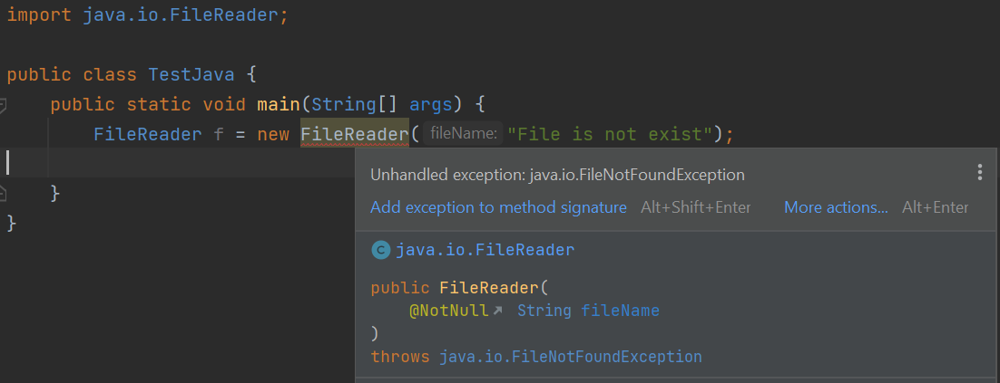
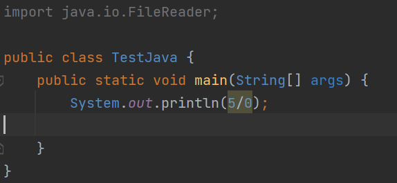
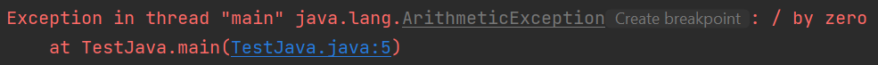
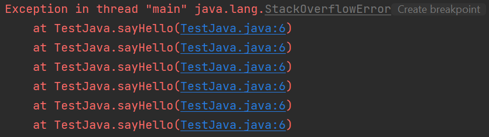
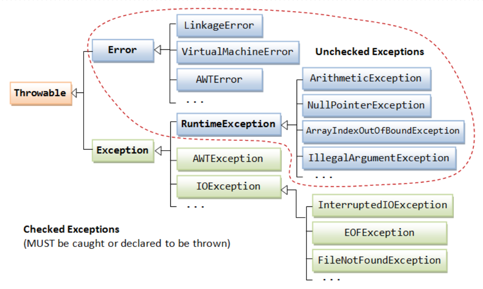
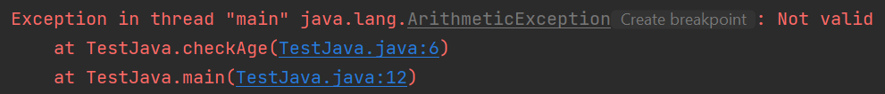
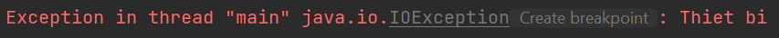
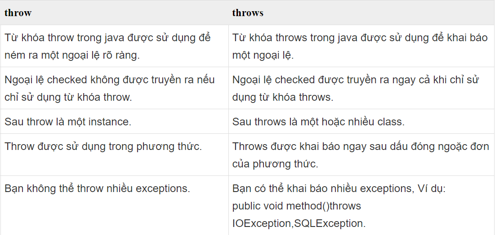

# [BUỔI 9] - LUÔN CÓ NGOẠI LỆ, XỬ LÍ NGOẠI LỆ

## 1. Làm quen với Exception
### 1.1. Ngoại lệ (Exception) là gì?

Exception là một sự kiện xảy ra trong quá trình thực thi một chương trình Java, nó làm phá vỡ flow (luồng xử lý) bình thường của một chương trình, thậm chí chết chương trình.

Một ngoại lệ có thể xảy ra với nhiều lý do khác nhau, nó nằm ngoài dự tính của chương trình. Một vài ngoại lệ xảy ra bởi lỗi của người dùng, một số khác bởi lỗi của lập trình viên và số khác nữa đến từ lỗi của nguồn dữ liệu vật lý. Chẳng hạn như:

- Người dùng nhập dữ liệu không hợp lệ.
- Truy cập ngoài chỉ số mảng.
- Một file cần được mở nhưng không thể tìm thấy.
- Kết nối mạng bị ngắt trong quá trình thực hiện giao tiếp hoặc JVM hết bộ nhớ.
- ….

### 1.2. Checked và Unchecked Exception
Trong Java có 2 loại exception: checked và unchecked.
- **Checked exceptions**

Là loại exception xảy ra trong lúc compile time, nó cũng có thể được gọi là compile time exceptions. Loại exception này không thể bỏ qua được trong quá trình compile, bắt buộc ta phải handle nó.

``Ví dụ: IOException, FileNotFoundException, NoSuchFieldException, ….``



- **UnChecked exceptions**

Là loại exception xảy ra tại thời điểm thực thi chương trình, nó cũng có thể gọi là runtime exceptions đó là programming bugs, lỗi logic của chương trình… Loại exception này được bỏ qua trong quá trình compile, không bắt buộc ta phải handle nó.

``Ví dụ: NullPointerException, NumberFormatException, ArrayIndexOutOfBoundsException, DivideByZeroException, …``


Chương trình hiện lỗi khi chạy:


### 1.3. Error
Error là những vấn đề nghiêm trọng liên quan đến môi trường thực thi của ứng dụng hoặc hệ thống mà lập trình viên không thể kiểm soát. Nó thường làm chết chương trình.

``Ví dụ: OutOfMemoryError, VirtualMachineError, StackOverflowError, …``

```java
public class TestJava {
    public static void sayHello()
    {
        sayHello();
    }
    public static void main(String[] args) {
        sayHello();
    }
}
```


## 2. Bắt Exception với try-catch
Khối try-catch trong Java được sử dụng để xử lý các ngoại lệ (exceptions) trong chương trình. Khi một ngoại lệ xảy ra trong khối try, nó sẽ được bắt bởi khối catch tương ứng, giúp chương trình không bị dừng đột ngột.

- Cú pháp của try - catch trong Java
```java
try {
    // Mã lệnh có thể gây ra ngoại lệ
} catch (Exception_Type e) {
    // Xử lý ngoại lệ
}
```
### Một số ví dụ sử dụng try - catch trong java

#### VD1: Xử lý chia cho 0
```java
public class TestJava {
    public static void main(String[] args) {
        Scanner sc = new Scanner(System.in);
        try {
            int num1 = 3;
            int num2 = sc.nextInt();
            int result = num1 / num2;
        } catch (ArithmeticException e) {
            System.out.println("Lỗi chia cho 0: " + e.getMessage());
        }
        System.out.println("Chương trình tiếp tục chạy...");
    }
}
```
Nhập giá trị của biến num2 là 0, kết quả:
```java
Lỗi chia cho 0: / by zero
Chương trình tiếp tục chạy...
```
#### VD2: Xử lý nhập sai định dạng số

```java
public class TestJava {
    public static void main(String[] args) {
        Scanner sc = new Scanner(System.in);
        try {
            System.out.print("Nhập một số nguyên: ");
            int number = Integer.parseInt(sc.next()); // Có thể ném ra NumberFormatException
            System.out.println("Số bạn vừa nhập: " + number);
        } catch (NumberFormatException e) {
            System.out.println("Sai định dạng số: " + e.getMessage());
        }
        sc.close();
    }
}
```
Nếu nhập một số nguyên:
```java
Nhập một số nguyên: 4
Số bạn vừa nhập: 4
```

Nếu nhập một kí tự không phải một số nguyên:
```java
Nhập một số nguyên: a
Sai định dạng số: For input string: "a"
```
## 3. Sử dụng finally
Khi một ngoại lệ xuất hiện, phương thức đang được thực thi có thể bị dừng mà không được hoàn thành. Nếu điều này xảy ra, thì các đoạn mã phía sau (ví dụ như đoạn mã có chức năng thu hồi tài nguyên, như các lệnh đóng tập viết ở cuối phương thức) sẽ không bao giờ được gọi. Java cung cấp khối finally để giải quyết việc này. Thông thường khối finally chứa các câu lệnh mang tính chất dọn dẹp như: đóng kết nối CSDL, đóng tệp tin,…

Khối lệnh finally trong java luôn được thực thi cho dù có ngoại lệ xảy ra hay không hoặc gặp lệnh return trong khối try.

**Cấu trúc khối finally trong java**
```java
try{
  //Các lệnh có khả năng ném ra ngoại lệ
} catch(Exception1 ex1){
…
} catch(Exception2 ex2){
…
} catch(Exception exn){
…
} finally{
//Mã lệnh dọn dẹp
}
```
``Khối finally là tuỳ chọn, không bắt buộc phải có. Khối này được đặt sau khối catch cuối cùng. Chương trình sẽ thực thi câu lệnh đầu tiên của khối finally ngay sau khi gặp câu lệnh return hay lệnh break trong khối try.``

#### Ví dụ sử dụng finally trong Java

- **Ví dụ sử dụng khối lệnh finally nơi ngoại lệ không xảy ra.**

```java
public class TestJava {
    public static void main(String args[]) {
        try {
            int data = 25 / 5;
            System.out.println(data);
        } catch (NullPointerException e) {
            System.out.println(e);
        } finally {
            System.out.println("finally block is always executed");
        }
        System.out.println("rest of the code...");
    }
}
```
Kết quả:
```java
5
finally block is always executed
rest of the code...
```

- **Ví dụ sử dụng khối lệnh finally nơi ngoại lệ xảy ra nhưng không xử lý.**
```java
public class TestJava {
    public static void main(String args[]) {
        try {
            int data = 25 / 0;
            System.out.println(data);
        } catch (NullPointerException e) {
            System.out.println(e);
        } finally {
            System.out.println("finally block is always executed");
        }
        System.out.println("rest of the code...");
    }
}
```
Kết quả:
```java
finally block is always executed
Exception in thread "main" java.lang.ArithmeticException: / by zero
```
- **Ví dụ sử dụng khối lệnh finally nơi ngoại lệ xảy ra và được xử lý.**
```java
public class TestJava {
    public static void main(String args[]) {
        try {
            int data = 25 / 0;
            System.out.println(data);
        } catch (ArithmeticException e) {
            System.out.println("Catch exception " + e.getMessage());
        } finally {
            System.out.println("finally block is always executed");
        }
        System.out.println("rest of the code...");
    }
}
```
Kết quả:
```java
Catch exception / by zero
finally block is always executed
rest of the code...
```

- **Ví dụ sử dụng khối lệnh finally trong trường hợp trong khối try có lệnh return.**
```java
public class TestJava {
    public static void main(String args[]) {
        try {
            int data = 25;
            if (data % 2 != 0) {
                System.out.println(data + " is odd number");
                return;
            }
        } catch (ArithmeticException e) {
            System.out.println(e);
        } finally {
            System.out.println("finally block is always executed");
        }
        System.out.println("rest of the code...");
    }
}
```
Kết quả:
```java
25 is odd number
finally block is always executed
```
## 4. Cây phân cấp Exception

Đây là mô hình sơ đồ phân cấp của Exception trong java.

Class ở mức cao nhất là Throwable.

Hai class con trực tiếp là Error và Exception.

Trong nhánh Exception có một nhánh con RuntimeException là các ngoại lệ sẽ không được java kiểm tra trong thời điểm biên dịch.

## 5. Throw và throws
### 5.1. Throw
Từ khoá throw trong java được sử dụng để ném ra một ngoại lệ (exception) cụ thể.

Chúng ta có thể ném một trong hai ngoại lệ checked hoặc unchecked trong java bằng từ khóa throw. Từ khóa throw chủ yếu được sử dụng để ném ngoại lệ tùy chỉnh (ngoại lệ do người dùng tự định nghĩa).

**Cú pháp:**

```java
throw exception;
```
Ví dụ: tạo ra phương thức checkAge() với tham số truyền vào là giá trị integer. Nếu tuổi dưới 18, chúng ta ném ra ngoại lệ ArithmeticException nếu không in ra một thông báo “Valid”.
```java
public class TestJava {
    public static void checkAge(int age)
    {
        if(age < 18)
        {
            throw new ArithmeticException("Not valid");
        }
        else System.out.println("Valid");
    }

    public static void main(String[] args) {
        checkAge(13);
    }
}
```
Kết quả:


### 5.2. Throws
Từ khóa throws trong java được sử dụng để khai báo một ngoại lệ. Nó thể hiện thông tin cho lập trình viên rằng có thể xảy ra một ngoại lệ, vì vậy nó là tốt hơn cho các lập trình viên để cung cấp các mã xử lý ngoại lệ để duy trì luồng bình thường của chương trình.

Exception Handling chủ yếu được sử dụng để xử lý ngoại lệ checked. Nếu xảy ra bất kỳ ngoại lệ unchecked như NullPointerException, đó là lỗi của lập trình viên mà anh ta không thực hiện kiểm tra trước khi code được sử dụng.

**Cú pháp:**
```java
return_type method_name() throws exception_class_name {
// method code
}
```
**Ngoại lệ nào nên được khai báo**
> 
>Chỉ ngoại lệ checked, bởi vì:
> 
>Ngoại lệ unchecked: nằm trong sự kiểm soát của bạn.
> 
>error: nằm ngoài sự kiểm soát của bạn, ví dụ bạn sẽ không thể làm được bất kì điều gì khi các lỗi VirtualMachineError hoặc StackOverflowError xảy ra.


>Quy tắc: Nếu bạn đang gọi một phương thức khai báo throws một ngoại lệ, bạn phải bắt hoặc throws ngoại lệ đó.

Có hai trường hợp:

- TH1: Bạn đã bắt ngoại lệ, tức là xử lý ngoại lệ bằng cách sử dụng try/catch.

- TH2: Bạn khai báo ném ngoại lệ, tức là sử dụng từ khóa throws với phương thức.

#### TH1: xử lý ngoại lệ với try/catch

Trong trường hợp bạn xử lý ngoại lệ, code sẽ được thực thi tốt cho dù ngoại lệ có xuất hiện trong chương trình hay không.

```java
import java.io.IOException;
 
class M {
    void method() throws IOException {
        throw new IOException("Loi thiet bi");
    }
}
 
public class TestJava {
    public static void main(String args[]) {
        try {
            M m = new M();
            m.method();
        } catch (Exception e) {
            System.out.println("Ngoai le duoc xu ly");
        }
 
        System.out.println("Hello...");
    }
}
```
Kết quả:
```java
Ngoai le duoc xu ly
Hello...
```

#### TH2: Khai báo throws ngoại lệ
- Trong trường hợp bạn khai báo throws ngoại lệ, nếu ngoại lệ không xảy ra, code sẽ được thực hiện tốt.
- Trong trường hợp bạn khai báo throws ngoại lệ, nếu ngoại lệ xảy ra, một ngoại lệ sẽ được ném ra tại runtime vì throws nên không xử lý ngoại lệ đó.
1. Ngoại lệ không xảy ra
```java
import java.io.IOException;
 
class M {
    void method() throws IOException {
        System.out.println("Thiet bi dang hoat dong tot");
    }
}
 
public class TestJava {
    public static void main(String args[]) throws IOException {
        M m = new M();
        m.method();
        System.out.println("Hello...");
    }
}
```
Kết quả:
```java
Thiet bi dang hoat dong tot
Luong binh thuong...
```

2. Ngoại lệ xảy ra
```java
import java.io.IOException;
 
class M {
    void method() throws IOException {
        throw new IOException("Thiet bi");
    }
}
 
public class TestJava {
    public static void main(String args[]) throws IOException {
        M m = new M();
        m.method();
        System.out.println("Hello...");
    }
}
```
Kết quả:


### 5.3. Sự khác biệt giữa throw và throws


## 6. Tạo ra Exception của riêng mình
Custom Exception là ngoại lệ do người dùng tự định nghĩa. Custom Exception trong Java được sử dụng để tùy biến ngoại lệ theo yêu cầu của người dùng. Bởi sự giúp đỡ của loại ngoại lệ này, người dùng có thể có riêng kiểu và thông điệp ngoại lệ riêng cho mình.

Thông thường, để tạo ra custom exception thuộc loại checked chúng ta kế thừa từ lớp Exception. Để tạo custom exception thuộc loại unchecked chúng ta kế thừa từ lớp RuntimeException.

### Ví dụ Custom Checked Exception
```java
class InvalidAgeException extends Exception {
    InvalidAgeException(String s) {
        super(s);
    }
}
```
Sử dụng ngoại lệ tùy chỉnh:
```java
class CustomException {
 
    static void validate(int age) throws InvalidAgeException {
        if (age < 18) {
            throw new InvalidAgeException("not valid");
        } else {
            System.out.println("welcome to vote");
        }
    }
 
    public static void main(String args[]) {
        try {
            validate(13);
        } catch (Exception m) {
            System.out.println("Exception occured: " + m);
        }
 
        System.out.println("rest of the code...");
    }
}
```
Kết quả:
```java
Exception occured: InvalidAgeException: not valid
rest of the code...
```